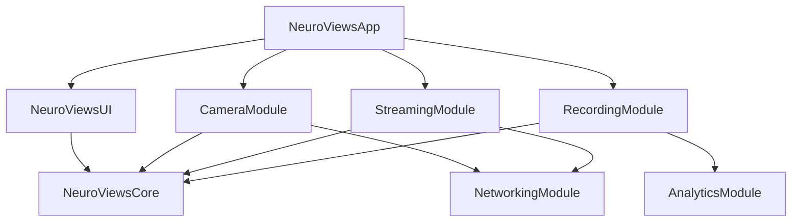

# NeuroViews 2.0 - Architecture Decision Records (ADRs)

## Tabla de Contenidos

1. [Introducción](#introducción)
2. [ADR-001: Adopción de Clean Architecture](#adr-001-adopción-de-clean-architecture)
3. [ADR-002: Actor Model para Concurrencia](#adr-002-actor-model-para-concurrencia)
4. [ADR-003: SwiftUI + UIKit Híbrido](#adr-003-swiftui--uikit-híbrido)
5. [ADR-004: Modularización del Código](#adr-004-modularización-del-código)
6. [ADR-005: Strategy Pattern para Multi-Plataforma](#adr-005-strategy-pattern-para-multi-plataforma)
7. [ADR-006: Repository Pattern para Datos](#adr-006-repository-pattern-para-datos)
8. [ADR-007: Coordinator Pattern para Navegación](#adr-007-coordinator-pattern-para-navegación)
9. [ADR-008: Dependency Injection Container](#adr-008-dependency-injection-container)
10. [ADR-009: Error Handling Strategy](#adr-009-error-handling-strategy)
11. [ADR-010: Testing Architecture](#adr-010-testing-architecture)

---

## Introducción

Este documento contiene las decisiones arquitectónicas clave para NeuroViews 2.0. Cada ADR sigue el formato:

- **Estado**: Propuesta/Aceptada/Superseded
- **Contexto**: La situación que requiere una decisión
- **Decisión**: La decisión tomada
- **Consecuencias**: Resultados positivos y negativos
- **Alternativas Consideradas**: Otras opciones evaluadas

---

## ADR-001: Adopción de Clean Architecture

**Estado**: Aceptada  
**Fecha**: 2024-12-11  
**Decisores**: Equipo de Arquitectura

### Contexto

NeuroViews 1.0 sufre de acoplamiento fuerte entre componentes, dificultando testing, mantenimiento y escalabilidad. El CameraManager actual tiene 1,087 líneas y múltiples responsabilidades.

### Decisión

Adoptar Clean Architecture con las siguientes capas:

```
┌─────────────────────────────────────┐
│         Presentation Layer          │
│    (SwiftUI Views + ViewModels)     │
└─────────────────┬───────────────────┘
                  │
┌─────────────────▼───────────────────┐
│           Domain Layer              │
│     (Use Cases + Entities)          │
└─────────────────┬───────────────────┘
                  │
┌─────────────────▼───────────────────┐
│            Data Layer               │
│   (Repositories + Data Sources)     │
└─────────────────────────────────────┘
```

#### Estructura de Directorios:
```
Sources/
├── Presentation/
│   ├── ViewModels/
│   ├── Views/
│   └── Coordinators/
├── Domain/
│   ├── UseCases/
│   ├── Entities/
│   ├── Protocols/
│   └── Errors/
└── Data/
    ├── Repositories/
    ├── DataSources/
    └── Models/
```

### Consecuencias

**Positivas:**
- Separación clara de responsabilidades
- Testing más fácil con dependency injection
- Reducción de acoplamiento entre capas
- Escalabilidad mejorada
- Reusabilidad de business logic

**Negativas:**
- Complejidad inicial mayor
- Más archivos para gestionar
- Curva de aprendizaje para el equipo
- Overhead en proyectos pequeños

### Alternativas Consideradas

1. **MVVM Simple**: Rechazada por falta de separación de domain logic
2. **MVC**: Rechazada por problemas de Massive View Controllers
3. **VIPER**: Rechazada por excesiva complejidad para nuestro caso de uso

---

## ADR-002: Actor Model para Concurrencia

**Estado**: Aceptada  
**Fecha**: 2024-12-11  
**Decisores**: Equipo de Desarrollo

### Contexto

NeuroViews maneja operaciones concurrentes complejas (cámara, grabación, streaming) con problemas de race conditions, deadlocks y crashes relacionados con threading.

### Decisión

Adoptar el Actor Model de Swift 6.2 para manejar concurrencia:

```swift
// Domain Actors para business logic
actor CameraSessionActor {
    private var session: AVCaptureSession?
    
    func startSession() async throws {
        // Thread-safe implementation
    }
}

// MainActor para UI components
@MainActor
final class CameraViewModel: ObservableObject {
    private let sessionActor: CameraSessionActor
    
    func startRecording() async {
        try await sessionActor.startSession()
    }
}
```

#### Arquitectura de Actors:

```
┌─────────────────┐    ┌──────────────────┐
│  @MainActor     │    │  Domain Actors   │
│  ViewModels     │───▶│  - Session       │
│  Views          │    │  - Device        │
│  Coordinators   │    │  - Storage       │
└─────────────────┘    └──────────────────┘
```

### Consecuencias

**Positivas:**
- Eliminación de race conditions
- Code más seguro con compile-time checks
- Mejor performance con structured concurrency
- Debugging más fácil
- Compliance con Swift 6 strict concurrency

**Negativas:**
- Migración compleja desde callbacks/GCD
- Restricciones en sharing data entre actors
- Curva de aprendizaje pronunciada
- Debugging de actor boundaries puede ser complejo

### Alternativas Consideradas

1. **GCD + Locks**: Rechazada por propensión a errores
2. **Operation Queues**: Rechazada por complejidad de gestión
3. **Combine**: Mantiene para reactive programming, complementa actors

---

## ADR-003: SwiftUI + UIKit Híbrido

**Estado**: Aceptada  
**Fecha**: 2024-12-11  
**Decisores**: Equipo UI/UX

### Contexto

NeuroViews requiere interfaces complejas (cámara preview, controles profesionales) que pueden beneficiarse de SwiftUI moderno, pero ciertas funcionalidades requieren UIKit/AppKit.

### Decisión

Adoptar arquitectura híbrida SwiftUI + UIKit:

```swift
// SwiftUI para nueva UI
struct CameraView: View {
    @StateObject private var viewModel: CameraViewModel
    
    var body: some View {
        VStack {
            // Custom UIKit component wrapped
            CameraPreviewRepresentable(viewModel: viewModel)
            
            // SwiftUI controls
            CameraControlsView(viewModel: viewModel)
        }
    }
}

// UIKit wrapped para casos específicos
struct CameraPreviewRepresentable: UIViewRepresentable {
    let viewModel: CameraViewModel
    
    func makeUIView(context: Context) -> CameraPreviewView {
        CameraPreviewView(viewModel: viewModel)
    }
    
    func updateUIView(_ uiView: CameraPreviewView, context: Context) {
        uiView.updatePreview()
    }
}
```

#### Estrategia de Adopción:
- **SwiftUI**: Nueva UI, settings, overlays
- **UIKit**: Camera preview, complex gestures, legacy components
- **Migration**: Gradual, component por component

### Consecuencias

**Positivas:**
- Leveraging SwiftUI moderno para rapid development
- Mantenimiento de performance crítico con UIKit
- Future-proof architecture
- Mejor declarative UI para settings

**Negativas:**
- Complejidad en bridging entre frameworks
- Posibles inconsistencias visuales
- Testing más complejo
- Bundle size ligeramente mayor

### Alternativas Consideradas

1. **SwiftUI Only**: Rechazada por limitaciones en camera preview
2. **UIKit Only**: Rechazada por desarrollo más lento
3. **React Native**: Rechazada por performance requirements

---

## ADR-004: Modularización del Código

**Estado**: Aceptada  
**Fecha**: 2024-12-11  
**Decisores**: Equipo de Arquitectura

### Contexto

El monolito actual dificulta el desarrollo paralelo, testing independiente y reutilización de código entre plataformas.

### Decisión

Dividir la aplicación en módulos Swift Package Manager:

```
NeuroViews/
├── NeuroViewsCore/           # Domain logic compartido
├── NeuroViewsUI/            # UI components compartidos  
├── CameraModule/            # Camera functionality
├── StreamingModule/         # Streaming features
├── RecordingModule/         # Recording capabilities
├── SettingsModule/          # Configuration UI
├── NetworkingModule/        # Network services
└── AnalyticsModule/         # Analytics & monitoring
```

#### Module Dependencies:


### Consecuencias

**Positivas:**
- Desarrollo paralelo entre módulos
- Testing independiente de cada módulo
- Reutilización entre plataformas
- Builds más rápidos (incremental compilation)
- Separación clara de responsabilidades

**Negativas:**
- Complejidad inicial en setup
- Gestión de versiones entre módulos
- Posible over-engineering para features pequeños
- Debugging across modules puede ser complejo

### Alternativas Consideradas

1. **Monolito**: Rechazada por problemas actuales
2. **CocoaPods**: Rechazada por preferir SPM nativo
3. **Carthage**: Rechazada por mantenimiento limitado

---

## ADR-005: Strategy Pattern para Multi-Plataforma

**Estado**: Aceptada  
**Fecha**: 2024-12-11  
**Decisores**: Equipo Multi-Plataforma

### Contexto

Cada plataforma (iOS, macOS, watchOS, visionOS) tiene requerimientos únicos pero comparte business logic común.

### Decisión

Implementar Strategy Pattern para platform-specific implementations:

```swift
// Protocol común
protocol PlatformStrategy: Sendable {
    func setupCamera() async throws
    func presentSettings() async
    func handleMemoryWarning() async
}

// iOS Strategy
final class iOSPlatformStrategy: PlatformStrategy {
    func setupCamera() async throws {
        // iOS-specific camera setup
        await requestPermissions()
        await setupHapticFeedback()
    }
    
    func handleMemoryWarning() async {
        await clearImageCache()
        await reduceVideoQuality()
    }
}

// macOS Strategy
final class macOSPlatformStrategy: PlatformStrategy {
    func setupCamera() async throws {
        // macOS-specific setup
        await setupMenuBarItem()
        await configureWindowManager()
    }
    
    func handleMemoryWarning() async {
        await closeUnusedWindows()
    }
}

// Context
@MainActor
final class AppCoordinator {
    private let platformStrategy: PlatformStrategy
    
    init(platformStrategy: PlatformStrategy) {
        self.platformStrategy = platformStrategy
    }
    
    func initializeApp() async throws {
        try await platformStrategy.setupCamera()
    }
}
```

### Consecuencias

**Positivas:**
- Código compartido maximizado
- Platform-specific optimizations
- Testing más fácil de cada estrategia
- Flexibilidad para añadir nuevas plataformas

**Negativas:**
- Abstracción adicional puede ocultar platform capabilities
- Complexity en interface design
- Posible duplicación de código similar

### Alternativas Consideradas

1. **Compiler Directives**: Rechazada por código menos limpio
2. **Separate Apps**: Rechazada por duplicación de business logic
3. **Bridge Pattern**: Considerada pero Strategy es más apropiado

---

## ADR-006: Repository Pattern para Datos

**Estado**: Aceptada  
**Fecha**: 2024-12-11  
**Decisores**: Equipo de Datos

### Contexto

NeuroViews necesita manejar múltiples fuentes de datos (local storage, iCloud, network APIs) con consistencia y testability.

### Decisión

Implementar Repository Pattern con múltiples data sources:

```swift
// Repository Protocol
protocol CameraConfigurationRepositoryProtocol: Sendable {
    func save(_ config: CameraConfiguration) async throws
    func load(id: UUID) async throws -> CameraConfiguration?
    func loadAll() async throws -> [CameraConfiguration]
    func delete(id: UUID) async throws
    func sync() async throws
}

// Repository Implementation
actor CameraConfigurationRepository: CameraConfigurationRepositoryProtocol {
    private let localDataSource: LocalDataSourceProtocol
    private let cloudDataSource: CloudDataSourceProtocol
    private let cacheDataSource: CacheDataSourceProtocol
    
    func save(_ config: CameraConfiguration) async throws {
        // Save locally first
        try await localDataSource.save(config)
        
        // Cache for quick access
        await cacheDataSource.cache(config)
        
        // Sync to cloud in background
        Task.detached {
            try? await self.cloudDataSource.sync(config)
        }
    }
    
    func load(id: UUID) async throws -> CameraConfiguration? {
        // Try cache first
        if let cached = await cacheDataSource.get(id: id) {
            return cached
        }
        
        // Try local storage
        if let local = try await localDataSource.load(id: id) {
            await cacheDataSource.cache(local)
            return local
        }
        
        // Fallback to cloud
        let cloud = try await cloudDataSource.load(id: id)
        if let config = cloud {
            await cacheDataSource.cache(config)
            try await localDataSource.save(config)
        }
        
        return cloud
    }
}
```

#### Data Flow:
```
Use Case → Repository → [Cache, Local, Cloud] Data Sources
```

### Consecuencias

**Positivas:**
- Abstracción clara de data access
- Multiple data sources sin acoplamiento
- Caching strategy integrado
- Testing fácil con mocks
- Offline-first approach

**Negativas:**
- Complejidad en data consistency
- Potential data conflicts entre sources
- Performance overhead en múltiples layers

### Alternativas Consideradas

1. **Direct Data Access**: Rechazada por acoplamiento fuerte
2. **Core Data**: Considerada, pero Repository es más flexible
3. **Single Data Source**: Rechazada por requirements offline/cloud

---

## ADR-007: Coordinator Pattern para Navegación

**Estado**: Aceptada  
**Fecha**: 2024-12-11  
**Decisores**: Equipo UI/UX

### Contexto

La navegación actual está dispersa en ViewControllers, dificultando testing y mantenimiento de flows complejos.

### Decisión

Implementar Coordinator Pattern para navigation management:

```swift
// Base Coordinator Protocol
protocol CoordinatorProtocol: AnyObject {
    var childCoordinators: [CoordinatorProtocol] { get set }
    func start()
    func coordinate(to coordinator: CoordinatorProtocol)
}

// App Coordinator
@MainActor
final class AppCoordinator: CoordinatorProtocol {
    var childCoordinators: [CoordinatorProtocol] = []
    private let window: UIWindow
    private let dependencyContainer: DIContainer
    
    func start() {
        let tabCoordinator = TabBarCoordinator(
            window: window,
            dependencyContainer: dependencyContainer
        )
        coordinate(to: tabCoordinator)
    }
}

// Feature Coordinator
@MainActor
final class CameraCoordinator: CoordinatorProtocol {
    var childCoordinators: [CoordinatorProtocol] = []
    private let navigationController: UINavigationController
    private let dependencyContainer: DIContainer
    
    func start() {
        showCameraView()
    }
    
    func showSettings() {
        let settingsCoordinator = SettingsCoordinator(
            navigationController: navigationController,
            dependencyContainer: dependencyContainer
        )
        coordinate(to: settingsCoordinator)
    }
}
```

#### Navigation Flow:
```
AppCoordinator → TabBarCoordinator → [Camera, Recordings, Settings]Coordinator
```

### Consecuencias

**Positivas:**
- Navegación centralizada y testeable
- ViewControllers focused en presentation
- Reutilización de navigation flows
- Deep linking más fácil de implementar

**Negativas:**
- Boilerplate code adicional
- Memory management de coordinators
- Complejidad en navigation stacks profundos

### Alternativas Consideradas

1. **Storyboard Segues**: Rechazada por falta de flexibilidad
2. **SwiftUI Navigation**: Considerada para futuro, pero insuficiente actualmente
3. **Router Pattern**: Similar, pero Coordinator más adecuado para iOS

---

## ADR-008: Dependency Injection Container

**Estado**: Aceptada  
**Fecha**: 2024-12-11  
**Decisores**: Equipo de Arquitectura

### Contexto

Testing y modularidad requieren dependency injection, pero Swift no tiene DI built-in robusto.

### Decisión

Implementar custom DI Container con protocol-based registration:

```swift
// DI Container Protocol
protocol DIContainerProtocol {
    func register<T>(_ type: T.Type, factory: @escaping () -> T)
    func register<T>(_ type: T.Type, instance: T)
    func resolve<T>(_ type: T.Type) -> T
    func resolve<T>(_ type: T.Type) -> T?
}

// Implementation
final class DIContainer: DIContainerProtocol {
    private var factories: [String: () -> Any] = [:]
    private var instances: [String: Any] = [:]
    
    func register<T>(_ type: T.Type, factory: @escaping () -> T) {
        let key = String(describing: type)
        factories[key] = factory
    }
    
    func register<T>(_ type: T.Type, instance: T) {
        let key = String(describing: type)
        instances[key] = instance
    }
    
    func resolve<T>(_ type: T.Type) -> T {
        let key = String(describing: type)
        
        // Try singleton instance first
        if let instance = instances[key] as? T {
            return instance
        }
        
        // Create from factory
        guard let factory = factories[key] else {
            fatalError("Type \(type) not registered in DI container")
        }
        
        return factory() as! T
    }
}

// Registration Example
extension DIContainer {
    static func setupProduction() -> DIContainer {
        let container = DIContainer()
        
        // Register actors
        container.register(CameraSessionActor.self) {
            CameraSessionActor()
        }
        
        // Register use cases
        container.register(CameraUseCaseProtocol.self) {
            CameraUseCase(
                sessionActor: container.resolve(CameraSessionActor.self)
            )
        }
        
        // Register repositories
        container.register(CameraRepositoryProtocol.self) {
            CameraRepository()
        }
        
        return container
    }
}
```

### Consecuencias

**Positivas:**
- Decoupling complete entre componentes
- Testing con mocks extremadamente fácil
- Configuration centralizada de dependencies
- Runtime swapping de implementations

**Negativas:**
- Runtime errors si registration es incorrecta
- Performance overhead en resolution
- Complejidad adicional en setup

### Alternativas Consideradas

1. **Third-party DI (Swinject)**: Rechazada por dependency externa
2. **Manual DI**: Rechazada por boilerplate excesivo
3. **Property Wrappers**: Considerada para futuro enhancement

---

## ADR-009: Error Handling Strategy

**Estado**: Aceptada  
**Fecha**: 2024-12-11  
**Decisores**: Equipo de Desarrollo

### Contexto

NeuroViews maneja múltiples tipos de errores (camera, network, storage) que requieren handling diferenciado.

### Decisión

Implementar typed error handling con Swift 6.2 typed throws:

```swift
// Domain-specific Error Types
enum CameraError: Error, LocalizedError, Sendable {
    case permissionDenied
    case deviceUnavailable
    case sessionConfigurationFailed
    case captureFailure(underlying: Error)
    
    var errorDescription: String? {
        switch self {
        case .permissionDenied:
            return NSLocalizedString("camera_permission_denied", comment: "")
        case .deviceUnavailable:
            return NSLocalizedString("camera_device_unavailable", comment: "")
        case .sessionConfigurationFailed:
            return NSLocalizedString("camera_session_failed", comment: "")
        case .captureFailure(let error):
            return NSLocalizedString("camera_capture_failed", comment: "") + ": \(error.localizedDescription)"
        }
    }
    
    var recoverySuggestion: String? {
        switch self {
        case .permissionDenied:
            return NSLocalizedString("camera_permission_recovery", comment: "")
        case .deviceUnavailable:
            return NSLocalizedString("camera_device_recovery", comment: "")
        default:
            return nil
        }
    }
}

// Typed Throws Implementation
func startCameraSession() async throws(CameraError) {
    guard await hasPermission() else {
        throw .permissionDenied
    }
    
    do {
        try await configureSession()
    } catch {
        throw .sessionConfigurationFailed
    }
}

// Error Recovery Strategy
actor ErrorRecoveryManager {
    private var retryCount: [String: Int] = [:]
    private let maxRetries = 3
    
    func executeWithRecovery<T>(
        operation: () async throws -> T,
        recovery: (Error) async throws -> T
    ) async throws -> T {
        do {
            return try await operation()
        } catch {
            return try await recovery(error)
        }
    }
    
    func executeWithRetry<T>(
        operationId: String,
        operation: () async throws -> T
    ) async throws -> T {
        let currentRetries = retryCount[operationId, default: 0]
        
        do {
            let result = try await operation()
            retryCount[operationId] = 0 // Reset on success
            return result
        } catch {
            guard currentRetries < maxRetries else {
                throw error
            }
            
            retryCount[operationId] = currentRetries + 1
            
            // Exponential backoff
            let delay = pow(2.0, Double(currentRetries)) * 1_000_000_000
            try await Task.sleep(nanoseconds: UInt64(delay))
            
            return try await executeWithRetry(operationId: operationId, operation: operation)
        }
    }
}
```

#### Error Handling Flow:
```
Use Case → Error → Recovery Strategy → User Notification
```

### Consecuencias

**Positivas:**
- Type safety en error handling
- Consistent error recovery strategies
- Better user experience con recovery suggestions
- Structured error logging

**Negativas:**
- Más complexity en error type definitions
- Potencial over-engineering para errores simples

### Alternativas Consideradas

1. **NSError**: Rechazada por falta de type safety
2. **Result Type**: Considerada, complementa para algunos casos
3. **Exception Handling**: No disponible en Swift

---

## ADR-010: Testing Architecture

**Estado**: Aceptada  
**Fecha**: 2024-12-11  
**Decisores**: Equipo de QA

### Contexto

NeuroViews requiere testing comprehensivo debido a complexity de camera operations y multi-platform support.

### Decisión

Implementar testing pyramid con múltiples niveles:

```swift
// Unit Tests - Domain Layer
@Test("Camera session starts correctly")
func testCameraSessionStart() async throws {
    let mockDevice = MockCameraDevice()
    let sessionActor = CameraSessionActor(device: mockDevice)
    
    try await sessionActor.startSession()
    
    let isRunning = await sessionActor.isSessionRunning
    #expect(isRunning == true)
}

// Integration Tests - Use Cases
@Test("Recording workflow completes")
func testRecordingWorkflow() async throws {
    let container = TestDIContainer()
    let useCase = container.resolve(CameraRecordingUseCaseProtocol.self)
    
    let session = try await useCase.startRecording(with: .default)
    let result = try await useCase.stopRecording(session)
    
    #expect(result.duration > 0)
    #expect(FileManager.default.fileExists(atPath: result.url.path))
}

// UI Tests - SwiftUI Views
@MainActor
@Test("Camera view displays correctly")
func testCameraViewDisplay() async throws {
    let mockViewModel = MockCameraViewModel()
    mockViewModel.isRecording = true
    
    let view = CameraView(viewModel: mockViewModel)
    let hosting = UIHostingController(rootView: view)
    
    // Render and validate
    _ = hosting.view
    
    #expect(mockViewModel.startRecordingCallCount == 0) // Not called yet
}

// Mock Implementations
actor MockCameraSessionActor: CameraSessionProtocol {
    private(set) var startSessionCallCount = 0
    private(set) var stopSessionCallCount = 0
    var shouldFailStart = false
    
    func startSession() async throws {
        startSessionCallCount += 1
        if shouldFailStart {
            throw CameraError.deviceUnavailable
        }
    }
    
    func stopSession() async throws {
        stopSessionCallCount += 1
    }
}

// Test DI Container
final class TestDIContainer: DIContainerProtocol {
    private let productionContainer = DIContainer()
    
    init() {
        setupTestDependencies()
    }
    
    private func setupTestDependencies() {
        // Register mocks instead of production implementations
        register(CameraSessionProtocol.self) {
            MockCameraSessionActor()
        }
        
        register(CameraUseCaseProtocol.self) {
            CameraUseCase(
                sessionActor: self.resolve(CameraSessionProtocol.self) as! MockCameraSessionActor
            )
        }
    }
}
```

#### Testing Levels:
1. **Unit Tests**: Individual components (actors, use cases)
2. **Integration Tests**: Component interactions
3. **UI Tests**: SwiftUI view rendering
4. **E2E Tests**: Complete user workflows
5. **Performance Tests**: Memory, CPU, battery usage

### Consecuencias

**Positivas:**
- High confidence en code quality
- Fast feedback loop
- Regression prevention
- Documentation through tests

**Negativas:**
- Significant development overhead
- Maintenance burden de test suite
- Posible over-testing de implementation details

### Alternativas Consideradas

1. **Manual Testing Only**: Rechazada por unreliability
2. **Only Unit Tests**: Insuficiente para complex interactions
3. **TDD Approach**: Considerada, será team preference

---

## Resumen de Decisiones

| ADR | Decisión | Estado | Impacto |
|-----|----------|--------|---------|
| 001 | Clean Architecture | ✅ Aceptada | Alto - Fundamental restructuring |
| 002 | Actor Model | ✅ Aceptada | Alto - Thread safety revolution |
| 003 | SwiftUI + UIKit | ✅ Aceptada | Medio - UI modernization |
| 004 | Modularización | ✅ Aceptada | Alto - Development workflow |
| 005 | Strategy Pattern | ✅ Aceptada | Medio - Multi-platform support |
| 006 | Repository Pattern | ✅ Aceptada | Medio - Data consistency |
| 007 | Coordinator Pattern | ✅ Aceptada | Medio - Navigation management |
| 008 | DI Container | ✅ Aceptada | Alto - Testability & flexibility |
| 009 | Error Handling | ✅ Aceptada | Medio - User experience |
| 010 | Testing Architecture | ✅ Aceptada | Alto - Code quality assurance |

---

## Implementación y Timeline

### Fase 1 (Mes 1): Foundation
- ADR-001: Clean Architecture setup
- ADR-008: DI Container implementation
- ADR-002: Basic Actor migration

### Fase 2 (Mes 2): Core Features
- ADR-006: Repository pattern
- ADR-009: Error handling
- ADR-004: Module extraction

### Fase 3 (Mes 3): UI/UX
- ADR-003: SwiftUI migration
- ADR-007: Coordinator implementation
- ADR-005: Platform strategies

### Fase 4 (Mes 4): Quality Assurance
- ADR-010: Testing implementation
- Performance optimization
- Documentation completion

Estas decisiones arquitectónicas aseguran que NeuroViews 2.0 sea una aplicación robusta, mantenible y escalable que aprovecha las mejores prácticas modernas de iOS development.