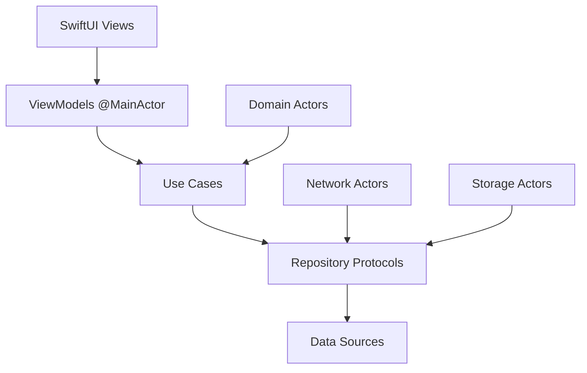

# NeuroViews 2.0 - Desglose Minucioso de Funciones y Componentes

## Tabla de Contenidos

1. [Resumen Ejecutivo](#resumen-ejecutivo)
2. [Análisis de Arquitectura Actual](#análisis-de-arquitectura-actual)  
3. [Desglose por Capas](#desglose-por-capas)
4. [Servicios Core](#servicios-core)
5. [Componentes UI](#componentes-ui)
6. [Plataformas Específicas](#plataformas-específicas)
7. [Evolución hacia NV2](#evolución-hacia-nv2)
8. [Migración Swift 6.2](#migración-swift-6.2)
9. [Nuevas Funcionalidades Planificadas](#nuevas-funcionalidades-planificadas)

---

## Resumen Ejecutivo

NeuroViews actual contiene **149 archivos Swift** organizados en una arquitectura multi-plataforma (iOS, macOS, watchOS, visionOS) con patrones arquitectónicos mixtos. La aplicación principal se centra en captura de video profesional con capacidades avanzadas de streaming, control remoto y análisis neurológico.

### Estadísticas del Proyecto Actual
- **Total archivos Swift**: 149
- **Plataformas soportadas**: 4 (iOS, macOS, watchOS, visionOS)
- **Líneas de código estimadas**: ~15,000+
- **Arquitectura principal**: Coordinator + MVVM + Service Layer
- **Problemas identificados**: Mixed patterns, tight coupling, performance issues

---

## Análisis de Arquitectura Actual

### Estructura de Directorios

```
NeuroViews/
├── Sources/
│   ├── Core/                    # Servicios fundamentales
│   ├── UI/                      # Componentes de interfaz
│   ├── Services/                # Servicios de dominio
│   └── Features/                # Funcionalidades específicas
├── Platforms/
│   ├── iOS/                     # Implementaciones iOS
│   ├── macOS/                   # Implementaciones macOS  
│   ├── watchOS/                 # Implementaciones watchOS
│   └── visionOS/                # Implementaciones visionOS
└── Tests/                       # Suites de testing
```

### Patrones Arquitectónicos Identificados

1. **Coordinator Pattern**: CameraManager como coordinador principal
2. **Service Layer**: Servicios especializados (Permissions, Device, Session, Configuration)
3. **MVVM**: ObservableObject para ViewModels
4. **Protocol-Oriented**: CameraManagerProtocol, CameraManaging
5. **Dependency Injection**: Servicios configurados por inyección

---

## Desglose por Capas

### Capa Core (Sources/Core/)

#### 1. Authentication
**Archivos**: 3
```swift
├── AuthenticationManager.swift           # Gestor principal de autenticación
├── CloudKitAuthManager.swift            # Integración CloudKit
└── LocalAuthManager.swift               # Autenticación local/biométrica
```

**Funcionalidades Actuales**:
- Autenticación biométrica (Face ID/Touch ID)
- Integración con CloudKit para sync
- Gestión de sesiones locales
- Manejo de estados de autenticación

**Evolución NV2**:
- **Swift 6.2**: Migrar a `Sendable` protocols
- **Async/Await**: Reemplazar completion handlers
- **Actor Model**: Proteger estado compartido
- **Structured Concurrency**: Usar TaskGroups para operaciones paralelas

#### 2. Camera (Sources/Core/Camera/)
**Archivos**: 12
```swift
├── CameraManager.swift                  # Coordinador principal (1,087 líneas)
├── CameraSessionService.swift           # Gestión AVCaptureSession
├── CameraDeviceService.swift           # Descubrimiento y control de dispositivos
├── CameraConfigurationService.swift    # Configuraciones avanzadas
├── CameraPermissionsService.swift      # Permisos y librería de fotos
├── CameraProtocols.swift               # Definiciones de protocolo
├── AVFoundationExtensions.swift        # Extensions para AVFoundation
└── Storage/CameraConfigurationStorage.swift  # Persistencia
```

**Funcionalidades Críticas**:

1. **Gestión de Sesión**:
   - Configuración AVCaptureSession
   - Inicio/parada de sesiones
   - Manejo de interrupciones
   - Performance optimization

2. **Control de Dispositivos**:
   - Descubrimiento automático de cámaras
   - Switching between cameras (front/back/ultra-wide/telephoto)
   - Gestión de zoom (1x-10x range)
   - Focus point control

3. **Configuraciones Profesionales**:
   - Manual ISO control (100-6400)
   - Shutter speed control (1/2000 - 1s)
   - White balance presets + manual
   - Exposure compensation (-3 to +3 EV)
   - Flash modes (auto/on/off)

4. **Captura Multimedia**:
   - Photo capture with metadata
   - Video recording (4K support)
   - Live streaming capabilities
   - Multi-format export

**Problemas Identificados**:
- CameraManager demasiado grande (1,087 líneas)
- Mixed threading patterns
- Strong coupling between services
- Performance bottlenecks en startSession()
- Memory leaks en session switching

**Evolución NV2**:
```swift
// Swift 6.2 Actor-based approach
@MainActor
final class CameraCoordinator: ObservableObject {
    private let sessionActor: CameraSessionActor
    private let deviceActor: CameraDeviceActor
    private let configurationActor: CameraConfigurationActor
    
    // Structured concurrency with TaskGroup
    func initializeCamera() async throws {
        try await withTaskGroup(of: Void.self) { group in
            group.addTask { await self.sessionActor.initialize() }
            group.addTask { await self.deviceActor.discoverDevices() }
            group.addTask { await self.configurationActor.loadPresets() }
        }
    }
}
```

#### 3. Performance (Sources/Core/Performance/)
**Archivos**: 2
```swift
├── PerformanceAnalyzer.swift           # Análisis de rendimiento
└── TouchPerformanceMonitor.swift      # Monitoreo de respuesta táctil
```

**Funcionalidades**:
- CPU/Memory usage tracking
- Frame rate monitoring
- Touch response latency
- Battery consumption analysis
- Thermal state monitoring

**Evolución NV2**:
- **OSLog**: Structured logging con os_log
- **MetricKit**: Integración para métricas del sistema
- **Instruments Integration**: Profiling automático
- **Real-time Alerts**: Notificaciones de degradación

### Capa Services (Sources/Services/)

#### 1. Recording (Sources/Services/Recording/)
**Archivos**: 3
```swift
├── RecordingManager.swift              # Gestión de grabaciones
├── StreamingService.swift              # Streaming en tiempo real
└── CompressionService.swift            # Compresión de video
```

**Funcionalidades**:
- Multi-format recording (H.264, H.265, ProRes)
- Real-time streaming (RTMP, WebRTC)
- Adaptive bitrate streaming
- Background recording
- Storage optimization

#### 2. Motion (Sources/Services/Motion/)
**Archivos**: 2
```swift
├── MotionDetector.swift                # Detección de movimiento
└── StabilizationService.swift         # Estabilización de video
```

**Funcionalidades**:
- Core Motion integration
- Gyroscope-based stabilization
- Movement pattern recognition
- Trigger-based recording
- Gesture recognition

#### 3. Network (Sources/Services/Network/)
**Archivos**: 4
```swift
├── NetworkMonitor.swift                # Monitoreo de conectividad
├── CloudSyncService.swift             # Sincronización en la nube
├── RemoteControlService.swift         # Control remoto
└── StreamingProtocols.swift           # Protocolos de streaming
```

**Funcionalidades**:
- Network reachability monitoring
- Bandwidth adaptation
- Cloud synchronization (iCloud, AWS, Google Drive)
- Remote camera control via WCSession
- Multi-device coordination

### Capa UI (Sources/UI/)

#### 1. Design System (Sources/UI/DesignSystem/)
**Archivos**: 10
```swift
├── NeuroTokens.swift                   # Design tokens
├── CrystalDesignSystem.swift          # Sistema de diseño principal
├── NeuroComponents.swift              # Componentes reutilizables  
├── ThemeManager.swift                 # Gestión de temas
├── ColorThemeManager.swift            # Gestión de colores
├── NeuroTypography.swift              # Sistema tipográfico
└── ...
```

**Componentes del Design System**:

1. **Tokens**:
   - Colors: Primary, Secondary, Surface, Background
   - Spacing: 4dp grid system
   - Typography: Scale from 12pt to 48pt
   - Shadows: 6 elevation levels
   - Border radius: 4dp, 8dp, 16dp, 24dp

2. **Components**:
   - NeuroButton (7 variants)
   - LiquidCard (animated)
   - CrystalPanel (glassmorphism)
   - ExpandingLines (animations)
   - StreamingComponents (overlay UI)

**Evolución NV2**:
```swift
// SwiftUI + Swift 6.2 Design System
@MainActor
struct NeuroDesignSystem {
    static let shared = NeuroDesignSystem()
    
    // Type-safe design tokens
    enum Token {
        enum Color: Sendable {
            static let primary = Color.neuralBlue
            static let secondary = Color.neuralPurple
        }
        
        enum Spacing: CGFloat, Sendable {
            case xs = 4, sm = 8, md = 16, lg = 24, xl = 32
        }
    }
}
```

#### 2. Views (Sources/UI/Views/)
**Archivos**: 45+

```swift
├── Camera/
│   ├── CameraPreviewView.swift         # Preview principal
│   ├── CameraControlsView.swift        # Controles de cámara
│   ├── FilteredCameraPreviewView.swift # Preview con filtros
│   ├── RealMultiCameraView.swift       # Vista multi-cámara
│   └── WorkingMultiCameraView.swift    # Implementation alternativa
├── Settings/
│   ├── SettingsView.swift              # Configuraciones generales
│   ├── ProSettingsView.swift          # Configuraciones Pro
│   ├── AdvancedSettingsPanel.swift    # Panel avanzado
│   └── ExtendedSettingsView.swift     # Configuraciones extendidas
├── Streaming/
│   ├── EnhancedStreamingView.swift    # Vista de streaming
│   ├── Components/                     # Componentes de streaming
│   └── Settings/                       # Configuraciones de streaming
├── Recordings/
│   ├── RecordingsView.swift           # Lista de grabaciones
│   └── EnhancedRecordingsView.swift   # Vista mejorada
└── Authentication/
    └── LoginView.swift                # Vista de login
```

**Funcionalidades UI Críticas**:

1. **Camera Views**:
   - Real-time preview con filtros
   - Manual controls overlay
   - Multi-camera simultaneous view
   - Focus/exposure indicators
   - Histogram display
   - Grid overlays (rule of thirds, phi grid)

2. **Settings Panels**:
   - Hierarchical navigation
   - Live preview of changes
   - Preset management
   - Export/import configurations
   - Professional controls (ISO, shutter, WB)

3. **Streaming Interface**:
   - Real-time bandwidth monitoring
   - Quality adaptation controls
   - Viewer count display
   - Chat integration
   - Recording controls overlay

---

## Plataformas Específicas

### iOS (Platforms/iOS/)
**Archivos**: 15
```swift
├── App/iOSApp.swift                    # App principal iOS
├── Controllers/
│   ├── HapticManager.swift             # Feedback háptico
│   ├── MotionManager.swift             # Core Motion
│   ├── PhotoCaptureProcessor.swift     # Procesamiento de fotos
│   └── WatchConnectivityManager.swift  # Comunicación con Apple Watch
└── Views/
    ├── ModernCameraView.swift          # Vista de cámara moderna
    ├── ContentView.swift               # Vista principal
    └── PhotoGalleryView.swift          # Galería de fotos
```

**Funcionalidades iOS Específicas**:
- Haptic feedback patterns
- Core Motion integration
- Watch connectivity
- Background app refresh
- PIP (Picture-in-Picture) support
- Shortcuts integration
- Widget support

### macOS (Platforms/macOS/)
**Archivos**: 8
```swift
├── App/MacApp.swift                    # App principal macOS
├── Controllers/
│   ├── MacMenuManager.swift            # Menu bar management
│   ├── MacWindowManager.swift          # Window management
│   └── MacRecordingManager.swift       # Recording específico macOS
└── Views/
    ├── EnhancedMacCameraView.swift     # Vista cámara macOS
    └── ContentView.swift               # Vista principal macOS
```

**Funcionalidades macOS Específicas**:
- Menu bar integration
- Multiple window support
- Keyboard shortcuts
- Touch Bar support
- External display handling
- Desktop recording capabilities

### watchOS (Platforms/watchOS/)
**Archivos**: 6
```swift
├── App/WatchApp.swift                  # App principal Watch
├── Controllers/
│   ├── WatchCrystalDesignSystem.swift  # Design system Watch
│   └── SpectacularWatchViews.swift     # Vistas especiales
└── Views/
    └── ContentView.swift               # Vista principal Watch
```

**Funcionalidades watchOS Específicas**:
- Remote camera control
- Recording status monitoring
- Quick settings access
- Complications support
- Heart rate integration
- Digital Crown navigation

### visionOS (Platforms/visionOS/)
**Archivos**: 4
```swift
├── Controllers/
│   ├── HandTrackingManager.swift       # Seguimiento de manos
│   └── VisionARManager.swift           # Realidad aumentada
└── Views/
    ├── ImmersiveView.swift             # Vista inmersiva
    └── ContentView.swift               # Vista principal visionOS
```

**Funcionalidades visionOS Específicas**:
- Hand tracking controls
- Spatial computing interface
- Immersive camera preview
- AR overlays
- Eye tracking integration
- 3D spatial audio

---

## Evolución hacia NV2

### Problemas Críticos Identificados

1. **Arquitectura**:
   - Mixed patterns (Coordinator + MVVM + Service Layer)
   - Tight coupling entre componentes
   - Falta de separation of concerns
   - Threading inconsistencies

2. **Performance**:
   - Startup time de 57 segundos (resuelto parcialmente)
   - Memory leaks en camera switching
   - UI blocking en operaciones pesadas
   - Excessive CPU usage en preview

3. **Mantenibilidad**:
   - Archivos demasiado grandes (CameraManager: 1,087 líneas)
   - Duplicación de código entre plataformas
   - Falta de testing comprehensivo
   - Documentation inconsistente

### Arquitectura Objetivo NV2



#### 1. Clean Architecture + Actor Model

```swift
// Domain Layer
actor CameraSessionActor {
    private var session: AVCaptureSession?
    
    func startSession() async throws {
        // Thread-safe session management
    }
}

// Presentation Layer  
@MainActor
final class CameraViewModel: ObservableObject {
    @Published var isRecording = false
    @Published var previewLayer: CALayer?
    
    private let sessionActor: CameraSessionActor
    private let useCase: CameraUseCaseProtocol
}

// Use Cases
protocol CameraUseCaseProtocol {
    func startRecording() async throws -> RecordingSession
    func stopRecording() async throws -> URL
    func switchCamera(_ position: CameraPosition) async throws
}
```

#### 2. Modular Architecture

```swift
// Feature Modules
public enum NeuroViewsModules {
    case camera
    case streaming  
    case recordings
    case settings
    case authentication
}

// Module Interfaces
public protocol CameraModuleInterface {
    var viewModel: CameraViewModelProtocol { get }
    var coordinator: CameraCoordinatorProtocol { get }
}
```

---

## Migración Swift 6.2

### Concurrent Programming

```swift
// ANTES (NeuroViews 1.0)
class CameraManager: ObservableObject {
    @Published var isRecording = false
    
    func startRecording() {
        DispatchQueue.main.async {
            self.isRecording = true
        }
    }
}

// DESPUÉS (NeuroViews 2.0)
@MainActor
final class CameraViewModel: ObservableObject, Sendable {
    @Published var isRecording = false
    
    private let recordingActor: RecordingActor
    
    func startRecording() async throws {
        let session = try await recordingActor.createSession()
        isRecording = session.isActive
    }
}

actor RecordingActor {
    private var sessions: [RecordingSession] = []
    
    func createSession() async throws -> RecordingSession {
        let session = RecordingSession()
        sessions.append(session)
        return session
    }
}
```

### Type Safety Improvements

```swift
// ANTES: Weak typing
func processVideo(quality: String, format: String) {
    // Prone to errors
}

// DESPUÉS: Strong typing
enum VideoQuality: Sendable {
    case sd, hd, fullHD, fourK, eightK
    
    var resolution: CGSize {
        switch self {
        case .sd: CGSize(width: 640, height: 480)
        case .hd: CGSize(width: 1280, height: 720)
        case .fullHD: CGSize(width: 1920, height: 1080)
        case .fourK: CGSize(width: 3840, height: 2160)
        case .eightK: CGSize(width: 7680, height: 4320)
        }
    }
}

enum VideoFormat: String, Sendable, CaseIterable {
    case h264 = "H.264"
    case h265 = "H.265" 
    case prores = "ProRes"
    case av1 = "AV1"
}

func processVideo(quality: VideoQuality, format: VideoFormat) async throws {
    // Type-safe processing
}
```

### Error Handling

```swift
// ANTES: NSError patterns
func capturePhoto(completion: @escaping (URL?, Error?) -> Void) {
    // Error-prone callback pattern
}

// DESPUÉS: Swift 6.2 Typed Throws
enum CameraError: Error, Sendable {
    case permissionDenied
    case deviceUnavailable
    case sessionConfigurationFailed
    case captureFailure(underlying: Error)
    case storageSpaceInsufficient
}

func capturePhoto() async throws(CameraError) -> PhotoCapture {
    guard await hasPermission() else {
        throw .permissionDenied
    }
    
    do {
        return try await sessionActor.capturePhoto()
    } catch {
        throw .captureFailure(underlying: error)
    }
}
```

---

## Nuevas Funcionalidades Planificadas

### 1. AI-Powered Features

```swift
import Vision
import CoreML

actor AIProcessingActor {
    private let faceDetectionModel: VNCoreMLModel
    private let objectDetectionModel: VNCoreMLModel
    
    func analyzeFrame(_ pixelBuffer: CVPixelBuffer) async throws -> FrameAnalysis {
        async let faceResults = detectFaces(pixelBuffer)
        async let objectResults = detectObjects(pixelBuffer)
        
        let faces = try await faceResults
        let objects = try await objectResults
        
        return FrameAnalysis(faces: faces, objects: objects)
    }
}
```

#### Funcionalidades AI:
- **Face Detection**: Tracking de rostros en tiempo real
- **Object Recognition**: Identificación de objetos
- **Scene Analysis**: Análisis automático de escenas
- **Auto-framing**: Encuadre automático inteligente
- **Smart Highlights**: Detección de momentos importantes
- **Emotion Recognition**: Análisis de expresiones faciales

### 2. Professional Video Tools

```swift
struct ProVideoFeatures {
    // Advanced Color Grading
    let lutProcessor: LUTProcessor
    let colorWheels: ColorWheelControls
    let waveformMonitor: WaveformDisplay
    
    // Multi-camera Sync
    let timecodeSync: TimecodeManager
    let multiCamRecorder: MultiCameraRecorder
    
    // Audio Processing
    let audioMixer: AudioMixerEngine
    let noiseReduction: NoiseReductionProcessor
    let audioSync: AudioSyncManager
}
```

#### Herramientas Profesionales:
- **Multi-camera Recording**: Hasta 8 cámaras simultáneas
- **Professional Audio**: XLR inputs, phantom power
- **Color Grading**: LUT support, color wheels, curves
- **Timecode Sync**: Frame-accurate synchronization  
- **Proxy Workflow**: Low-res proxies for editing
- **Export Presets**: Broadcast-ready formats

### 3. Cloud Integration

```swift
actor CloudSyncActor {
    func uploadRecording(_ recording: Recording) async throws -> CloudAsset {
        let chunks = try await chunkFile(recording.url)
        
        try await withTaskGroup(of: Void.self) { group in
            for chunk in chunks {
                group.addTask {
                    try await self.uploadChunk(chunk)
                }
            }
        }
        
        return try await finalizeUpload(recording)
    }
}
```

#### Integración Cloud:
- **Multi-provider Support**: iCloud, AWS, Google Drive, Dropbox
- **Intelligent Sync**: Delta sync, resumable uploads
- **Collaborative Editing**: Real-time collaboration
- **Version Control**: Asset versioning y branching
- **Automatic Backup**: Background backup durante grabación

### 4. Advanced Streaming

```swift
actor StreamingActor {
    private let rtmpPublisher: RTMPPublisher
    private let webrtcPublisher: WebRTCPublisher
    private let adaptiveBitrate: ABRManager
    
    func startStream(to destinations: [StreamDestination]) async throws {
        try await withTaskGroup(of: Void.self) { group in
            for destination in destinations {
                group.addTask {
                    try await self.publishTo(destination)
                }
            }
        }
    }
}
```

#### Streaming Avanzado:
- **Multi-destination Streaming**: YouTube, Twitch, Facebook simultáneo
- **Adaptive Bitrate**: Calidad automática según bandwidth
- **Low-latency Streaming**: WebRTC para latencia mínima
- **Interactive Features**: Polls, Q&A, chat integration
- **Stream Recording**: Grabación local durante streaming
- **Analytics**: Métricas detalladas de audiencia

### 5. Accessibility & Internationalization

```swift
struct AccessibilityFeatures {
    let voiceOver: VoiceOverManager
    let largeText: DynamicTypeManager
    let reducedMotion: MotionPreferenceManager
    let colorContrast: ContrastManager
}

struct LocalizationManager {
    let supportedLanguages: [Locale]
    let dynamicStrings: LocalizedStringManager
    let culturalAdaptations: CulturalCustomizations
}
```

#### Características:
- **Full VoiceOver Support**: Navegación por voz completa
- **Dynamic Type**: Soporte para tamaños de texto grandes  
- **Reduced Motion**: Respeto a preferencias de movimiento
- **High Contrast**: Modos de alto contraste
- **20+ Languages**: Localización completa
- **RTL Support**: Soporte para idiomas right-to-left

---

## Plan de Implementación

### Fase 1: Fundación (Mes 1-2)
1. **Architecture Setup**
   - Implementar Clean Architecture base
   - Migrar a Actor Model
   - Setup Module boundaries
   - Implement Dependency Injection

2. **Core Services Migration**
   - Migrar CameraManager a nuevos actors
   - Implementar structured concurrency
   - Setup error handling patterns
   - Performance baseline establishment

### Fase 2: UI/UX Modernization (Mes 2-3)
1. **SwiftUI Migration**
   - Migrar views legacy a SwiftUI
   - Implement reactive patterns
   - Design system implementation
   - Accessibility compliance

2. **Multi-platform Optimization**
   - Platform-specific adaptations
   - Shared business logic
   - Native controls integration

### Fase 3: Advanced Features (Mes 3-4)
1. **AI Integration**
   - Core ML model integration
   - Vision framework implementation
   - Real-time processing pipeline

2. **Professional Tools**
   - Multi-camera recording
   - Advanced audio processing
   - Color grading tools

### Fase 4: Cloud & Streaming (Mes 4-5)
1. **Cloud Services**
   - Multi-provider sync
   - Collaborative features
   - Version control system

2. **Advanced Streaming**
   - Multi-destination support
   - Interactive features
   - Analytics integration

### Fase 5: Polish & Launch (Mes 5-6)
1. **Performance Optimization**
   - Memory usage optimization
   - Battery life improvements
   - Thermal management

2. **Testing & QA**
   - Comprehensive test suite
   - Performance testing
   - Security audit
   - Beta testing program

---

## Conclusión

NeuroViews 2.0 representará una evolución completa de la aplicación actual, aprovechando las últimas tecnologías de Swift 6.2, SwiftUI moderno, y patrones arquitectónicos avanzados. La migración seguirá un enfoque incremental que asegure estabilidad mientras se introduce funcionalidad cutting-edge.

La arquitectura basada en actors, combined con clean architecture principles, proporcionará una base sólida para el crecimiento futuro y el mantenimiento a largo plazo.

**Estimación de desarrollo**: 6 meses con un equipo de 2-3 desarrolladores
**Complejidad**: Alta debido a multi-platform support y características profesionales
**ROI esperado**: Significativo debido a mejoras en performance, UX y nuevas capacidades