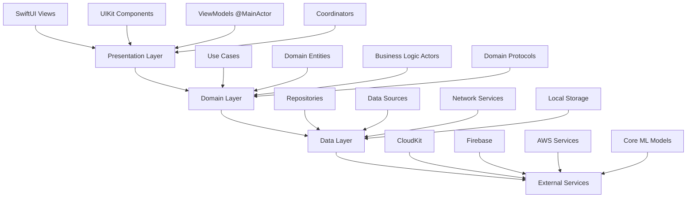

# NeuroViews 2.0 - Technical Specifications

## Tabla de Contenidos

1. [Platform Requirements](#platform-requirements)
2. [Architecture Overview](#architecture-overview)
3. [Core Modules Specification](#core-modules-specification)
4. [API Specifications](#api-specifications)
5. [Data Models](#data-models)
6. [Performance Requirements](#performance-requirements)
7. [Security Specifications](#security-specifications)
8. [Testing Requirements](#testing-requirements)
9. [Deployment Specifications](#deployment-specifications)
10. [Third-Party Integrations](#third-party-integrations)

---

## Platform Requirements

### Minimum System Requirements

#### iOS
```yaml
Platform: iOS
Minimum Version: 17.0
Recommended: iOS 17.2+
Architecture: arm64 (Universal Binary)
Memory: 4GB RAM minimum, 6GB+ recommended
Storage: 2GB available space
Camera: Required (dual camera preferred)
Network: WiFi or Cellular data connection
Special: 
  - Neural Engine (A12+) for AI features
  - TrueDepth camera for advanced focus tracking
```

#### macOS
```yaml
Platform: macOS
Minimum Version: 14.0 (Sonoma)
Recommended: macOS 14.2+
Architecture: Apple Silicon (M1+) or Intel x86_64
Memory: 8GB RAM minimum, 16GB+ recommended
Storage: 4GB available space
Camera: FaceTime HD camera or external camera
Network: WiFi or Ethernet connection
Special:
  - Metal-capable GPU for video processing
  - AVCaptureDevice compatible camera
```

#### watchOS
```yaml
Platform: watchOS
Minimum Version: 10.0
Recommended: watchOS 10.2+
Architecture: arm64 (Series 4+)
Memory: 1GB+ RAM
Storage: 32MB for app data
Connectivity: Bluetooth to paired iPhone
Special:
  - WatchConnectivity framework support
  - Digital Crown for navigation
```

#### visionOS
```yaml
Platform: visionOS
Minimum Version: 1.0
Recommended: visionOS 1.1+
Architecture: arm64 (Apple Vision Pro)
Memory: 16GB+ RAM
Storage: 1GB available space
Connectivity: WiFi required
Special:
  - Hand tracking capability
  - Eye tracking capability
  - Spatial computing environment
```

### Development Requirements

#### Hardware
```yaml
Development Machine:
  - Mac Studio (M2 Ultra) or MacBook Pro (M3 Pro+)
  - 32GB+ RAM for smooth development
  - 1TB+ SSD for Xcode and simulators
  - External 4K monitor for multi-platform development

Testing Devices:
  iOS:
    - iPhone 15 Pro (primary)
    - iPhone 14 (secondary)
    - iPad Pro 12.9" (tablet testing)
  macOS:
    - MacBook Pro 16" (Mac Catalyst testing)
  watchOS:
    - Apple Watch Series 9 (primary)
    - Apple Watch SE (secondary)
  visionOS:
    - Apple Vision Pro (required for spatial computing)
```

#### Software
```yaml
Development Tools:
  - Xcode 15.2+ (Swift 6.2 support)
  - iOS Simulator 17.0+
  - Reality Composer Pro (visionOS)
  - Instruments (performance profiling)
  - Create ML (AI model training)

Version Control:
  - Git 2.40+
  - GitHub Desktop or command-line

CI/CD:
  - GitHub Actions
  - Fastlane 2.217+
  - SwiftLint 0.54+
  - SwiftFormat 0.52+
```

---

## Architecture Overview

### High-Level System Architecture



### Module Architecture

```swift
// Module Dependency Graph
enum NeuroViewsModule: String, CaseIterable {
    case core = "NeuroViewsCore"
    case ui = "NeuroViewsUI" 
    case camera = "CameraModule"
    case streaming = "StreamingModule"
    case recording = "RecordingModule"
    case settings = "SettingsModule"
    case networking = "NetworkingModule"
    case analytics = "AnalyticsModule"
    case ai = "AIProcessingModule"
    case storage = "StorageModule"
    
    var dependencies: [NeuroViewsModule] {
        switch self {
        case .core:
            return []
        case .ui:
            return [.core]
        case .camera:
            return [.core, .storage]
        case .streaming:
            return [.core, .networking, .camera]
        case .recording:
            return [.core, .storage, .camera]
        case .settings:
            return [.core, .ui, .storage]
        case .networking:
            return [.core]
        case .analytics:
            return [.core, .networking]
        case .ai:
            return [.core]
        case .storage:
            return [.core]
        }
    }
}
```

### Concurrency Architecture

```swift
// Actor Hierarchy and Responsibilities
actor CameraSystemCoordinator {
    private let sessionActor: CameraSessionActor
    private let deviceActor: CameraDeviceActor
    private let configurationActor: CameraConfigurationActor
    private let recordingActor: RecordingActor
    
    func coordinateOperation(_ operation: CameraOperation) async throws {
        // Coordinate between actors safely
    }
}

// MainActor Components
@MainActor
protocol ViewModelProtocol: ObservableObject {
    associatedtype State: Sendable
    var state: State { get }
    func handle(_ action: ViewAction) async
}

// Domain Actors
actor CameraSessionActor: Sendable {
    private var session: AVCaptureSession?
    private var state: SessionState = .inactive
    
    nonisolated var currentState: SessionState { state }
}
```

---

## Core Modules Specification

### 1. NeuroViewsCore Module

#### Core Entities
```swift
// Camera Domain Models
struct CameraDevice: Sendable, Identifiable {
    let id: String
    let name: String
    let position: AVCaptureDevice.Position
    let deviceType: AVCaptureDevice.DeviceType
    let capabilities: CameraCapabilities
}

struct CameraCapabilities: Sendable {
    let supportsManualExposure: Bool
    let supportsManualFocus: Bool
    let supportsManualWhiteBalance: Bool
    let zoomRange: ClosedRange<Float>
    let isoRange: ClosedRange<Float>
    let shutterSpeedRange: ClosedRange<Double>
    let supportedFormats: [VideoFormat]
}

struct CameraConfiguration: Sendable, Codable {
    let id: UUID
    let name: String
    let preset: CameraPreset
    let videoFormat: VideoFormat
    let resolution: VideoResolution
    let frameRate: Int
    let exposureSettings: ExposureSettings?
    let focusSettings: FocusSettings?
    let whiteBalanceSettings: WhiteBalanceSettings?
    let createdAt: Date
    let modifiedAt: Date
}

enum VideoFormat: String, Sendable, CaseIterable {
    case h264 = "H.264"
    case h265 = "H.265"
    case prores422 = "ProRes 422"
    case prores4444 = "ProRes 4444"
    case av1 = "AV1"
    
    var codecType: AVVideoCodecType {
        switch self {
        case .h264: return .h264
        case .h265: return .hevc
        case .prores422: return .proRes422
        case .prores4444: return .proRes4444XQ
        case .av1: return .av1
        }
    }
}

enum VideoResolution: String, Sendable, CaseIterable {
    case sd480p = "SD 480p"
    case hd720p = "HD 720p"
    case fullHD1080p = "Full HD 1080p"
    case ultraHD4K = "4K UHD"
    case cinema4K = "4K Cinema"
    case uhd8K = "8K UHD"
    
    var dimensions: CGSize {
        switch self {
        case .sd480p: return CGSize(width: 854, height: 480)
        case .hd720p: return CGSize(width: 1280, height: 720)
        case .fullHD1080p: return CGSize(width: 1920, height: 1080)
        case .ultraHD4K: return CGSize(width: 3840, height: 2160)
        case .cinema4K: return CGSize(width: 4096, height: 2160)
        case .uhd8K: return CGSize(width: 7680, height: 4320)
        }
    }
}
```

#### Error Definitions
```swift
enum NeuroViewsError: Error, LocalizedError, Sendable {
    case camera(CameraError)
    case recording(RecordingError)
    case streaming(StreamingError)
    case storage(StorageError)
    case network(NetworkError)
    case ai(AIProcessingError)
    case permission(PermissionError)
    case configuration(ConfigurationError)
    
    var errorDescription: String? {
        switch self {
        case .camera(let error): return error.localizedDescription
        case .recording(let error): return error.localizedDescription
        case .streaming(let error): return error.localizedDescription
        case .storage(let error): return error.localizedDescription
        case .network(let error): return error.localizedDescription
        case .ai(let error): return error.localizedDescription
        case .permission(let error): return error.localizedDescription
        case .configuration(let error): return error.localizedDescription
        }
    }
}

enum CameraError: Error, LocalizedError, Sendable {
    case permissionDenied
    case deviceUnavailable(deviceID: String)
    case sessionConfigurationFailed(underlying: Error?)
    case captureFailure(reason: CaptureFailureReason)
    case deviceSwitchFailed(from: String, to: String)
    case unsupportedConfiguration(CameraConfiguration)
    case hardwareFailure(String)
    
    var errorDescription: String? {
        switch self {
        case .permissionDenied:
            return NSLocalizedString("camera.error.permission_denied", comment: "Camera permission denied")
        case .deviceUnavailable(let deviceID):
            return NSLocalizedString("camera.error.device_unavailable", comment: "Camera device unavailable: \(deviceID)")
        case .sessionConfigurationFailed(let error):
            return NSLocalizedString("camera.error.session_failed", comment: "Session configuration failed: \(error?.localizedDescription ?? "Unknown")")
        case .captureFailure(let reason):
            return NSLocalizedString("camera.error.capture_failed", comment: "Capture failed: \(reason)")
        case .deviceSwitchFailed(let from, let to):
            return NSLocalizedString("camera.error.switch_failed", comment: "Failed to switch from \(from) to \(to)")
        case .unsupportedConfiguration(let config):
            return NSLocalizedString("camera.error.unsupported_config", comment: "Unsupported configuration: \(config.name)")
        case .hardwareFailure(let message):
            return NSLocalizedString("camera.error.hardware_failure", comment: "Hardware failure: \(message)")
        }
    }
}
```

### 2. CameraModule Specification

#### Core Camera Actor
```swift
actor CameraSessionActor {
    // MARK: - Private Properties
    private var session: AVCaptureSession?
    private var videoInput: AVCaptureDeviceInput?
    private var audioInput: AVCaptureDeviceInput?
    private var photoOutput: AVCapturePhotoOutput?
    private var videoOutput: AVCaptureVideoDataOutput?
    private var audioOutput: AVCaptureAudioDataOutput?
    
    private var currentDevice: AVCaptureDevice?
    private var currentConfiguration: CameraConfiguration?
    private var sessionState: SessionState = .inactive
    
    // MARK: - Public Interface
    func configure(with configuration: CameraConfiguration) async throws {
        guard sessionState == .inactive else {
            throw CameraError.sessionConfigurationFailed(underlying: nil)
        }
        
        sessionState = .configuring
        currentConfiguration = configuration
        
        try await setupSession()
        sessionState = .configured
    }
    
    func startSession() async throws {
        guard sessionState == .configured else {
            throw CameraError.sessionConfigurationFailed(underlying: nil)
        }
        
        sessionState = .starting
        
        await withCheckedContinuation { continuation in
            Task.detached(priority: .userInitiated) { [weak self] in
                guard let self = self else {
                    continuation.resume()
                    return
                }
                
                await MainActor.run {
                    self.session?.startRunning()
                }
                
                await self.setSessionState(.active)
                continuation.resume()
            }
        }
    }
    
    func stopSession() async {
        guard sessionState == .active else { return }
        
        sessionState = .stopping
        session?.stopRunning()
        sessionState = .inactive
    }
    
    func capturePhoto(settings: PhotoCaptureSettings = .default) async throws -> PhotoCaptureResult {
        guard sessionState == .active else {
            throw CameraError.captureFailure(reason: .sessionNotActive)
        }
        
        guard let photoOutput = photoOutput else {
            throw CameraError.captureFailure(reason: .outputNotConfigured)
        }
        
        let captureSettings = AVCapturePhotoSettings()
        captureSettings.flashMode = settings.flashMode.avFlashMode
        
        if settings.enableRAW && photoOutput.availableRawPhotoPixelFormatTypes.count > 0 {
            captureSettings.rawPhotoPixelFormatType = photoOutput.availableRawPhotoPixelFormatTypes.first!
        }
        
        return try await withCheckedThrowingContinuation { continuation in
            let delegate = PhotoCaptureDelegate { result in
                continuation.resume(with: result)
            }
            
            photoOutput.capturePhoto(with: captureSettings, delegate: delegate)
        }
    }
    
    // MARK: - Private Methods
    private func setupSession() async throws {
        let newSession = AVCaptureSession()
        
        // Configure session preset
        if let preset = currentConfiguration?.preset.avSessionPreset {
            if newSession.canSetSessionPreset(preset) {
                newSession.sessionPreset = preset
            }
        }
        
        // Setup video input
        try await setupVideoInput(for: newSession)
        
        // Setup audio input if needed
        if currentConfiguration?.audioEnabled == true {
            try await setupAudioInput(for: newSession)
        }
        
        // Setup outputs
        try await setupOutputs(for: newSession)
        
        session = newSession
    }
    
    private func setSessionState(_ state: SessionState) async {
        sessionState = state
    }
}

// Supporting Types
enum SessionState: Sendable {
    case inactive
    case configuring
    case configured
    case starting
    case active
    case stopping
    case error(Error)
}

struct PhotoCaptureSettings: Sendable {
    let flashMode: FlashMode
    let enableRAW: Bool
    let enableHEIF: Bool
    let qualityPrioritization: AVCapturePhotoOutput.QualityPrioritization
    
    static let `default` = PhotoCaptureSettings(
        flashMode: .auto,
        enableRAW: false,
        enableHEIF: true,
        qualityPrioritization: .balanced
    )
}

struct PhotoCaptureResult: Sendable {
    let photoData: Data
    let rawData: Data?
    let metadata: [String: Any]
    let captureSettings: AVCapturePhotoSettings
    let timestamp: Date
    let location: CLLocation?
}
```

### 3. RecordingModule Specification

#### Recording Actor
```swift
actor RecordingActor {
    // MARK: - Private Properties
    private var movieFileOutput: AVCaptureMovieFileOutput?
    private var recordingSessions: [UUID: RecordingSession] = [:]
    private var currentRecordingID: UUID?
    private var backgroundTask: UIBackgroundTaskIdentifier?
    
    // MARK: - Public Interface
    func startRecording(with configuration: RecordingConfiguration) async throws -> RecordingSession {
        guard currentRecordingID == nil else {
            throw RecordingError.recordingAlreadyActive
        }
        
        let sessionID = UUID()
        let outputURL = try createOutputURL(for: configuration)
        
        let session = RecordingSession(
            id: sessionID,
            configuration: configuration,
            outputURL: outputURL,
            startTime: Date(),
            state: .starting
        )
        
        recordingSessions[sessionID] = session
        currentRecordingID = sessionID
        
        // Enable background recording if needed
        if configuration.allowBackgroundRecording {
            await enableBackgroundRecording()
        }
        
        // Start actual recording
        guard let movieOutput = movieFileOutput else {
            throw RecordingError.outputNotConfigured
        }
        
        let delegate = MovieFileOutputDelegate(recordingActor: self, sessionID: sessionID)
        movieOutput.startRecording(to: outputURL, recordingDelegate: delegate)
        
        // Update session state
        var updatedSession = session
        updatedSession.state = .recording
        recordingSessions[sessionID] = updatedSession
        
        return updatedSession
    }
    
    func stopRecording(_ sessionID: UUID) async throws -> RecordingResult {
        guard let session = recordingSessions[sessionID],
              currentRecordingID == sessionID else {
            throw RecordingError.sessionNotFound(sessionID)
        }
        
        movieFileOutput?.stopRecording()
        
        // Wait for recording to complete
        return try await withCheckedThrowingContinuation { continuation in
            // Delegate will resume continuation when recording finishes
            recordingCompletionHandlers[sessionID] = continuation
        }
    }
    
    func pauseRecording(_ sessionID: UUID) async throws {
        // Implementation for pause functionality
    }
    
    func resumeRecording(_ sessionID: UUID) async throws {
        // Implementation for resume functionality
    }
    
    // MARK: - Background Recording
    private func enableBackgroundRecording() async {
        await MainActor.run {
            backgroundTask = UIApplication.shared.beginBackgroundTask(withName: "NeuroViews Recording") {
                // Handle expiration
            }
        }
    }
    
    private func disableBackgroundRecording() async {
        guard let taskID = backgroundTask else { return }
        
        await MainActor.run {
            UIApplication.shared.endBackgroundTask(taskID)
        }
        
        backgroundTask = nil
    }
}

// Supporting Types
struct RecordingConfiguration: Sendable, Codable {
    let videoFormat: VideoFormat
    let resolution: VideoResolution
    let frameRate: Int
    let videoBitrate: Int
    let audioEnabled: Bool
    let audioBitrate: Int
    let allowBackgroundRecording: Bool
    let outputDirectory: URL?
    let filenamingScheme: FilenamingScheme
    
    static let `default` = RecordingConfiguration(
        videoFormat: .h265,
        resolution: .fullHD1080p,
        frameRate: 30,
        videoBitrate: 10_000_000, // 10 Mbps
        audioEnabled: true,
        audioBitrate: 128_000, // 128 kbps
        allowBackgroundRecording: true,
        outputDirectory: nil,
        filenamingScheme: .timestamp
    )
}

struct RecordingSession: Sendable, Identifiable {
    let id: UUID
    let configuration: RecordingConfiguration
    let outputURL: URL
    let startTime: Date
    var endTime: Date?
    var state: RecordingState
    var estimatedFileSize: Int64?
    var actualDuration: TimeInterval?
    
    var duration: TimeInterval {
        if let endTime = endTime {
            return endTime.timeIntervalSince(startTime)
        }
        return Date().timeIntervalSince(startTime)
    }
}

enum RecordingState: Sendable {
    case starting
    case recording
    case paused
    case stopping
    case completed
    case failed(Error)
}

struct RecordingResult: Sendable {
    let sessionID: UUID
    let outputURL: URL
    let duration: TimeInterval
    let fileSize: Int64
    let videoFormat: VideoFormat
    let resolution: VideoResolution
    let metadata: RecordingMetadata
}

struct RecordingMetadata: Sendable, Codable {
    let creationDate: Date
    let location: CLLocation?
    let deviceModel: String
    let appVersion: String
    let cameraPosition: AVCaptureDevice.Position
    let exposureSettings: ExposureSettings?
    let customTags: [String: String]
}
```

### 4. StreamingModule Specification

#### Streaming Actor
```swift
actor StreamingActor {
    // MARK: - Private Properties
    private var streamingSessions: [UUID: StreamingSession] = [:]
    private var rtmpPublisher: RTMPPublisher?
    private var webrtcPublisher: WebRTCPublisher?
    private var adaptiveBitrateManager: AdaptiveBitrateManager?
    
    // MARK: - Public Interface
    func startStreaming(to destinations: [StreamDestination]) async throws -> StreamingSession {
        let sessionID = UUID()
        
        let session = StreamingSession(
            id: sessionID,
            destinations: destinations,
            startTime: Date(),
            state: .connecting
        )
        
        streamingSessions[sessionID] = session
        
        // Initialize publishers based on destination types
        try await setupPublishers(for: destinations)
        
        // Start adaptive bitrate management
        adaptiveBitrateManager = AdaptiveBitrateManager()
        await adaptiveBitrateManager?.startMonitoring()
        
        // Begin streaming
        for destination in destinations {
            try await startStreamingToDestination(destination, sessionID: sessionID)
        }
        
        var updatedSession = session
        updatedSession.state = .streaming
        streamingSessions[sessionID] = updatedSession
        
        return updatedSession
    }
    
    func stopStreaming(_ sessionID: UUID) async throws {
        guard var session = streamingSessions[sessionID] else {
            throw StreamingError.sessionNotFound(sessionID)
        }
        
        session.state = .stopping
        streamingSessions[sessionID] = session
        
        // Stop all publishers
        await rtmpPublisher?.stopPublishing()
        await webrtcPublisher?.disconnect()
        await adaptiveBitrateManager?.stopMonitoring()
        
        session.state = .stopped
        session.endTime = Date()
        streamingSessions[sessionID] = session
    }
    
    func updateStreamQuality(_ quality: StreamQuality, for sessionID: UUID) async throws {
        guard let session = streamingSessions[sessionID] else {
            throw StreamingError.sessionNotFound(sessionID)
        }
        
        // Update bitrate for all active publishers
        await rtmpPublisher?.updateBitrate(quality.videoBitrate)
        await webrtcPublisher?.updateBitrate(quality.videoBitrate)
    }
    
    // MARK: - Private Methods
    private func setupPublishers(for destinations: [StreamDestination]) async throws {
        let rtmpDestinations = destinations.filter { $0.protocol == .rtmp }
        let webrtcDestinations = destinations.filter { $0.protocol == .webrtc }
        
        if !rtmpDestinations.isEmpty {
            rtmpPublisher = RTMPPublisher()
            try await rtmpPublisher?.initialize()
        }
        
        if !webrtcDestinations.isEmpty {
            webrtcPublisher = WebRTCPublisher()
            try await webrtcPublisher?.initialize()
        }
    }
}

// Supporting Types
struct StreamDestination: Sendable, Identifiable {
    let id: UUID
    let name: String
    let `protocol`: StreamingProtocol
    let url: URL
    let streamKey: String?
    let authToken: String?
    let configuration: StreamConfiguration
}

enum StreamingProtocol: String, Sendable, CaseIterable {
    case rtmp = "RTMP"
    case rtmps = "RTMPS"
    case webrtc = "WebRTC"
    case hls = "HLS"
    case dash = "DASH"
}

struct StreamConfiguration: Sendable {
    let videoCodec: VideoFormat
    let resolution: VideoResolution
    let frameRate: Int
    let videoBitrate: Int
    let audioBitrate: Int
    let keyframeInterval: Int
    let enableAdaptiveBitrate: Bool
}

struct StreamingSession: Sendable, Identifiable {
    let id: UUID
    let destinations: [StreamDestination]
    let startTime: Date
    var endTime: Date?
    var state: StreamingState
    var currentViewers: Int = 0
    var totalDataTransferred: Int64 = 0
    var currentBitrate: Int = 0
    var droppedFrames: Int = 0
}

enum StreamingState: Sendable {
    case connecting
    case streaming
    case buffering
    case reconnecting
    case stopping
    case stopped
    case error(StreamingError)
}
```

---

## API Specifications

### Internal Module APIs

#### Camera Use Case Protocol
```swift
protocol CameraUseCaseProtocol: Sendable {
    // Session Management
    func requestPermission() async -> Bool
    func setupCamera(with configuration: CameraConfiguration) async throws
    func startSession() async throws
    func stopSession() async throws
    func switchCamera(to position: AVCaptureDevice.Position) async throws
    
    // Capture Operations
    func capturePhoto(settings: PhotoCaptureSettings) async throws -> PhotoCaptureResult
    func startVideoRecording(configuration: RecordingConfiguration) async throws -> RecordingSession
    func stopVideoRecording(_ sessionID: UUID) async throws -> RecordingResult
    
    // Device Control
    func setZoom(_ factor: Float) async throws
    func setFocus(_ point: CGPoint, mode: AVCaptureDevice.FocusMode) async throws
    func setExposure(_ point: CGPoint, mode: AVCaptureDevice.ExposureMode) async throws
    func setWhiteBalance(_ mode: AVCaptureDevice.WhiteBalanceMode) async throws
    
    // Manual Controls
    func setManualISO(_ iso: Float) async throws
    func setManualShutterSpeed(_ duration: CMTime) async throws
    func setManualWhiteBalance(temperature: Float, tint: Float) async throws
    func setExposureCompensation(_ value: Float) async throws
    
    // Configuration
    func saveConfiguration(_ configuration: CameraConfiguration) async throws
    func loadConfiguration(_ id: UUID) async throws -> CameraConfiguration
    func getAvailableDevices() async -> [CameraDevice]
    func getCurrentDevice() async -> CameraDevice?
    func getCurrentConfiguration() async -> CameraConfiguration?
}
```

#### Streaming Use Case Protocol
```swift
protocol StreamingUseCaseProtocol: Sendable {
    // Stream Management
    func startStreaming(to destinations: [StreamDestination]) async throws -> StreamingSession
    func stopStreaming(_ sessionID: UUID) async throws
    func pauseStreaming(_ sessionID: UUID) async throws
    func resumeStreaming(_ sessionID: UUID) async throws
    
    // Quality Control
    func updateStreamQuality(_ quality: StreamQuality, for sessionID: UUID) async throws
    func enableAdaptiveBitrate(_ sessionID: UUID) async throws
    func disableAdaptiveBitrate(_ sessionID: UUID) async throws
    
    // Destinations
    func addDestination(_ destination: StreamDestination, to sessionID: UUID) async throws
    func removeDestination(_ destinationID: UUID, from sessionID: UUID) async throws
    func updateDestination(_ destination: StreamDestination, in sessionID: UUID) async throws
    
    // Analytics
    func getStreamingMetrics(_ sessionID: UUID) async throws -> StreamingMetrics
    func getSessionHistory() async throws -> [StreamingSession]
}
```

### External API Specifications

#### RESTful API Endpoints
```yaml
# Cloud Sync API
base_url: https://api.neuroviews.com/v2

endpoints:
  # Authentication
  POST /auth/login:
    body: { email: string, password: string }
    response: { token: string, user: User, expires_at: timestamp }
    
  POST /auth/refresh:
    headers: { Authorization: "Bearer {token}" }
    response: { token: string, expires_at: timestamp }
  
  # Configuration Sync
  GET /configurations:
    headers: { Authorization: "Bearer {token}" }
    params: { device_id: string, last_sync: timestamp }
    response: { configurations: [CameraConfiguration], deleted: [UUID] }
    
  POST /configurations:
    headers: { Authorization: "Bearer {token}" }
    body: { configuration: CameraConfiguration }
    response: { id: UUID, created_at: timestamp }
    
  PUT /configurations/{id}:
    headers: { Authorization: "Bearer {token}" }
    body: { configuration: CameraConfiguration }
    response: { updated_at: timestamp }
    
  DELETE /configurations/{id}:
    headers: { Authorization: "Bearer {token}" }
    response: { deleted_at: timestamp }
  
  # Recording Management
  GET /recordings:
    headers: { Authorization: "Bearer {token}" }
    params: { limit: int, offset: int, device_id: string }
    response: { recordings: [RecordingMetadata], total: int }
    
  POST /recordings/{id}/upload-url:
    headers: { Authorization: "Bearer {token}" }
    body: { file_size: int, content_type: string }
    response: { upload_url: string, expires_at: timestamp }
    
  POST /recordings/{id}/complete:
    headers: { Authorization: "Bearer {token}" }
    body: { metadata: RecordingMetadata }
    response: { processing_status: string, thumbnail_url: string }
  
  # Analytics
  POST /analytics/events:
    headers: { Authorization: "Bearer {token}" }
    body: { events: [AnalyticsEvent] }
    response: { processed: int }
    
  GET /analytics/usage:
    headers: { Authorization: "Bearer {token}" }
    params: { start_date: date, end_date: date }
    response: { usage: UsageStatistics }

# WebSocket API for Real-time Features
websocket_url: wss://ws.neuroviews.com/v2

messages:
  # Streaming Status
  streaming_started:
    type: "streaming_started"
    data: { session_id: UUID, destinations: [StreamDestination] }
    
  streaming_metrics:
    type: "streaming_metrics" 
    data: { session_id: UUID, metrics: StreamingMetrics }
    
  streaming_error:
    type: "streaming_error"
    data: { session_id: UUID, error: StreamingError }
    
  # Remote Control (watchOS)
  remote_command:
    type: "remote_command"
    data: { command: RemoteCommand, parameters: Any }
    
  device_status:
    type: "device_status"
    data: { device_id: string, status: DeviceStatus }
```

---

## Data Models

### Core Data Schema

#### CameraConfiguration Entity
```swift
// Core Data Model
@objc(CameraConfiguration)
class CameraConfigurationEntity: NSManagedObject {
    @NSManaged public var id: UUID
    @NSManaged public var name: String
    @NSManaged public var presetRawValue: String
    @NSManaged public var videoFormatRawValue: String
    @NSManaged public var resolutionRawValue: String
    @NSManaged public var frameRate: Int32
    @NSManaged public var exposureSettingsData: Data?
    @NSManaged public var focusSettingsData: Data?
    @NSManaged public var whiteBalanceSettingsData: Data?
    @NSManaged public var createdAt: Date
    @NSManaged public var modifiedAt: Date
    @NSManaged public var syncedAt: Date?
    @NSManaged public var cloudID: String?
    @NSManaged public var isDeleted: Bool
    
    // Computed Properties
    var preset: CameraPreset {
        get { CameraPreset(rawValue: presetRawValue) ?? .auto }
        set { presetRawValue = newValue.rawValue }
    }
    
    var videoFormat: VideoFormat {
        get { VideoFormat(rawValue: videoFormatRawValue) ?? .h264 }
        set { videoFormatRawValue = newValue.rawValue }
    }
    
    var resolution: VideoResolution {
        get { VideoResolution(rawValue: resolutionRawValue) ?? .fullHD1080p }
        set { resolutionRawValue = newValue.rawValue }
    }
}
```

#### Recording Entity
```swift
@objc(Recording)
class RecordingEntity: NSManagedObject {
    @NSManaged public var id: UUID
    @NSManaged public var filename: String
    @NSManaged public var localURL: URL?
    @NSManaged public var cloudURL: URL?
    @NSManaged public var duration: TimeInterval
    @NSManaged public var fileSize: Int64
    @NSManaged public var videoFormatRawValue: String
    @NSManaged public var resolutionRawValue: String
    @NSManaged public var frameRate: Int32
    @NSManaged public var metadataData: Data?
    @NSManaged public var thumbnailData: Data?
    @NSManaged public var createdAt: Date
    @NSManaged public var uploadedAt: Date?
    @NSManaged public var isUploaded: Bool
    @NSManaged public var isDeleted: Bool
    @NSManaged public var tags: Set<RecordingTag>
    
    // Relationships
    @NSManaged public var configuration: CameraConfigurationEntity?
}

@objc(RecordingTag)
class RecordingTagEntity: NSManagedObject {
    @NSManaged public var name: String
    @NSManaged public var color: String?
    @NSManaged public var recordings: Set<RecordingEntity>
}
```

### JSON Schema Specifications

#### Configuration Sync Schema
```json
{
  "$schema": "https://json-schema.org/draft/2020-12/schema",
  "title": "CameraConfiguration",
  "type": "object",
  "properties": {
    "id": {
      "type": "string",
      "format": "uuid"
    },
    "name": {
      "type": "string",
      "minLength": 1,
      "maxLength": 100
    },
    "preset": {
      "type": "string",
      "enum": ["auto", "portrait", "landscape", "macro", "sport", "night", "professional"]
    },
    "video_format": {
      "type": "string", 
      "enum": ["H.264", "H.265", "ProRes 422", "ProRes 4444", "AV1"]
    },
    "resolution": {
      "type": "string",
      "enum": ["SD 480p", "HD 720p", "Full HD 1080p", "4K UHD", "4K Cinema", "8K UHD"]
    },
    "frame_rate": {
      "type": "integer",
      "minimum": 1,
      "maximum": 240
    },
    "exposure_settings": {
      "type": "object",
      "properties": {
        "mode": {
          "type": "string",
          "enum": ["auto", "manual", "shutter_priority", "iso_priority"]
        },
        "iso": {
          "type": "number",
          "minimum": 50,
          "maximum": 6400
        },
        "shutter_speed": {
          "type": "number",
          "minimum": 0.000125,
          "maximum": 30.0
        },
        "exposure_compensation": {
          "type": "number",
          "minimum": -3.0,
          "maximum": 3.0
        }
      }
    },
    "created_at": {
      "type": "string",
      "format": "date-time"
    },
    "modified_at": {
      "type": "string",
      "format": "date-time"
    }
  },
  "required": ["id", "name", "preset", "video_format", "resolution", "frame_rate", "created_at", "modified_at"]
}
```

---

## Performance Requirements

### Application Performance Benchmarks

#### Startup Performance
```yaml
Cold Launch:
  Target: < 2.0 seconds to first frame
  Measurement: Time from app launch to camera preview visible
  Test Conditions: iPhone 14 Pro, iOS 17.2, fresh install

Warm Launch:
  Target: < 1.0 seconds to first frame
  Measurement: Time from backgrounded state to active camera preview
  Test Conditions: App backgrounded for < 30 minutes

Camera Session Startup:
  Target: < 1.0 seconds from request to preview
  Measurement: Time from startSession() call to preview rendering
  Test Conditions: Camera permission already granted
```

#### Runtime Performance
```yaml
Memory Usage:
  Baseline: < 100MB (no recording/streaming)
  Recording 4K: < 300MB peak usage
  Streaming HD: < 200MB sustained
  AI Processing: < 150MB additional

CPU Usage:
  Idle Preview: < 15% average
  Recording 4K: < 40% average
  Streaming HD: < 35% average  
  AI Processing: < 25% additional (using Neural Engine)

Battery Consumption:
  Preview Only: < 5% per hour
  Recording 1080p: < 20% per hour
  Recording 4K: < 35% per hour
  Streaming HD: < 25% per hour

Thermal Management:
  Sustained 4K Recording: 30+ minutes before thermal throttling
  Temperature Monitoring: Reduce quality automatically at 45°C
  Thermal Recovery: Resume full quality when < 40°C
```

#### Network Performance
```yaml
Streaming Performance:
  1080p Stream: 5-8 Mbps upload bandwidth
  720p Stream: 2-4 Mbps upload bandwidth  
  480p Stream: 1-2 Mbps upload bandwidth
  
Adaptive Bitrate:
  Quality Reduction: Within 5 seconds of bandwidth drop
  Quality Recovery: Within 10 seconds of bandwidth improvement
  Buffer Management: 5-15 seconds buffer maintained

Cloud Sync:
  Configuration Sync: < 2 seconds for typical payload
  Recording Upload: Background with progress tracking
  Offline Support: 7 days of offline operation
```

### Database Performance

#### Core Data Performance
```swift
// Performance Requirements
struct DatabasePerformanceTargets {
    static let configurationFetchTime: TimeInterval = 0.1 // 100ms
    static let recordingListFetchTime: TimeInterval = 0.5 // 500ms for 1000 items
    static let batchInsertTime: TimeInterval = 1.0 // 1 second for 100 records
    static let backgroundSaveTime: TimeInterval = 2.0 // 2 seconds for heavy saves
    
    // Memory constraints
    static let maxObjectsInMemory = 1000
    static let faultingThreshold = 500
}

// Optimized Fetch Requests
extension CameraConfigurationEntity {
    static var optimizedFetchRequest: NSFetchRequest<CameraConfigurationEntity> {
        let request: NSFetchRequest<CameraConfigurationEntity> = CameraConfigurationEntity.fetchRequest()
        request.fetchBatchSize = 50
        request.relationshipKeyPathsForPrefetching = ["exposureSettings", "focusSettings"]
        request.predicate = NSPredicate(format: "isDeleted == NO")
        request.sortDescriptors = [NSSortDescriptor(key: "modifiedAt", ascending: false)]
        return request
    }
}
```

---

## Security Specifications

### Data Protection

#### Encryption Standards
```yaml
Data at Rest:
  Algorithm: AES-256-GCM
  Key Management: iOS Keychain / macOS Keychain
  Scope: Configuration files, recording metadata, user credentials
  
Data in Transit:
  Protocol: TLS 1.3 minimum
  Certificate Pinning: Enabled for API endpoints
  HSTS: Enforced for all HTTPS connections
  
Cloud Storage:
  Encryption: Client-side encryption before upload
  Key Management: User-controlled encryption keys
  Zero-Knowledge: Server cannot decrypt user data
```

#### Authentication & Authorization
```swift
// Biometric Authentication
actor BiometricAuthManager {
    func requestAuthentication(reason: String) async throws -> Bool {
        let context = LAContext()
        
        guard context.canEvaluatePolicy(.deviceOwnerAuthenticationWithBiometrics, error: nil) else {
            throw AuthenticationError.biometricsNotAvailable
        }
        
        do {
            let success = try await context.evaluatePolicy(
                .deviceOwnerAuthenticationWithBiometrics,
                localizedReason: reason
            )
            return success
        } catch {
            throw AuthenticationError.biometricAuthenticationFailed(error)
        }
    }
}

// Token Management
actor TokenManager {
    private let keychain = KeychainWrapper.standard
    
    func storeToken(_ token: String, for service: String) async throws {
        guard keychain.set(token, forKey: service, withAccessibility: .whenUnlockedThisDeviceOnly) else {
            throw AuthenticationError.tokenStorageFailed
        }
    }
    
    func retrieveToken(for service: String) async throws -> String? {
        return keychain.string(forKey: service)
    }
    
    func deleteToken(for service: String) async {
        keychain.removeObject(forKey: service)
    }
}
```

#### Privacy Controls
```yaml
Permission Management:
  Camera: Required, request on first use
  Microphone: Optional, request when audio recording enabled
  Photos: Optional, request when saving to photo library
  Location: Optional, request when location tagging enabled
  Notifications: Optional, request for recording/streaming alerts

Data Collection:
  Analytics: Opt-in only, granular controls
  Crash Reporting: Anonymous, user can disable
  Usage Metrics: Device-local only unless explicitly shared
  
User Rights:
  Data Export: Full user data export in JSON format
  Data Deletion: Complete account and data deletion
  Data Portability: Standard format exports
  Consent Withdrawal: Granular consent management
```

### Network Security

#### API Security
```swift
// API Request Signing
struct APIRequestSigner {
    private let secretKey: Data
    
    func signRequest(_ request: URLRequest) -> URLRequest {
        var signedRequest = request
        
        let timestamp = String(Int(Date().timeIntervalSince1970))
        let nonce = UUID().uuidString
        
        // Create signature
        let payload = "\(request.httpMethod ?? "GET")\n\(request.url?.absoluteString ?? "")\n\(timestamp)\n\(nonce)"
        let signature = HMAC.authenticationCode(for: Data(payload.utf8), using: SymmetricKey(data: secretKey))
        
        signedRequest.setValue(timestamp, forHTTPHeaderField: "X-Timestamp")
        signedRequest.setValue(nonce, forHTTPHeaderField: "X-Nonce")
        signedRequest.setValue(Data(signature).base64EncodedString(), forHTTPHeaderField: "X-Signature")
        
        return signedRequest
    }
}

// Certificate Pinning
class CertificatePinner: NSURLSessionDelegate {
    private let pinnedCertificates: Set<Data>
    
    init(certificates: [Data]) {
        self.pinnedCertificates = Set(certificates)
    }
    
    func urlSession(_ session: URLSession, didReceive challenge: URLAuthenticationChallenge, completionHandler: @escaping (URLSession.AuthChallengeDisposition, URLCredential?) -> Void) {
        
        guard let serverTrust = challenge.protectionSpace.serverTrust,
              let certificate = SecTrustGetCertificateAtIndex(serverTrust, 0) else {
            completionHandler(.cancelAuthenticationChallenge, nil)
            return
        }
        
        let certificateData = SecCertificateCopyData(certificate)
        let data = Data(bytes: CFDataGetBytePtr(certificateData), count: CFDataGetLength(certificateData))
        
        if pinnedCertificates.contains(data) {
            completionHandler(.useCredential, URLCredential(trust: serverTrust))
        } else {
            completionHandler(.cancelAuthenticationChallenge, nil)
        }
    }
}
```

---

## Testing Requirements

### Unit Testing Strategy

#### Test Coverage Requirements
```yaml
Coverage Targets:
  Overall: 90% minimum
  Critical Paths: 100% (camera operations, recording, streaming)
  Business Logic: 95% (use cases, domain models)
  Data Layer: 85% (repositories, data sources)
  UI Layer: 70% (view models, coordinators)

Test Types:
  Unit Tests: 70% of total tests
  Integration Tests: 20% of total tests
  UI Tests: 10% of total tests
  Performance Tests: Separate suite

Execution Time:
  Unit Test Suite: < 30 seconds
  Integration Test Suite: < 5 minutes
  Full Test Suite: < 10 minutes
  Performance Tests: < 15 minutes
```

#### Test Implementation Examples
```swift
// Actor Testing
@Test("Camera session starts correctly")
func testCameraSessionStart() async throws {
    let mockDevice = MockCameraDevice()
    let sessionActor = CameraSessionActor(device: mockDevice)
    
    try await sessionActor.startSession()
    
    let isRunning = await sessionActor.isSessionRunning
    #expect(isRunning == true)
}

// Use Case Testing  
@Test("Recording workflow completes successfully")
func testRecordingWorkflow() async throws {
    let mockRepository = MockRecordingRepository()
    let useCase = RecordingUseCase(repository: mockRepository)
    
    let configuration = RecordingConfiguration.default
    let session = try await useCase.startRecording(with: configuration)
    
    #expect(session.state == .recording)
    
    let result = try await useCase.stopRecording(session.id)
    #expect(result.duration > 0)
    #expect(FileManager.default.fileExists(atPath: result.outputURL.path))
}

// Performance Testing
@Test("Camera startup performance")
func testCameraStartupPerformance() async throws {
    let startTime = CFAbsoluteTimeGetCurrent()
    let cameraManager = CameraManager()
    
    try await cameraManager.setupCamera()
    
    let elapsedTime = CFAbsoluteTimeGetCurrent() - startTime
    #expect(elapsedTime < 2.0, "Camera startup took \(elapsedTime)s, expected < 2.0s")
}

// Memory Testing
@Test("Recording memory usage within limits")
func testRecordingMemoryUsage() async throws {
    let initialMemory = getCurrentMemoryUsage()
    
    let recorder = RecordingManager()
    try await recorder.startRecording(configuration: .ultraHD4K)
    
    // Record for 10 seconds
    try await Task.sleep(nanoseconds: 10_000_000_000)
    
    let peakMemory = getCurrentMemoryUsage()
    let memoryIncrease = peakMemory - initialMemory
    
    try await recorder.stopRecording()
    
    #expect(memoryIncrease < 300_000_000, "Memory increase: \(memoryIncrease) bytes, expected < 300MB")
}
```

### Integration Testing

#### Multi-Platform Testing
```swift
// Platform-specific integration tests
final class PlatformIntegrationTests {
    
    @Test("iOS specific features work correctly")
    func testiOSIntegration() async throws {
        #if os(iOS)
        let hapticManager = HapticManager()
        let motionManager = MotionManager()
        let watchConnectivity = WatchConnectivityManager()
        
        await hapticManager.playCaptureFeedback()
        let motionData = try await motionManager.getCurrentMotionData()
        
        #expect(motionData != nil)
        #expect(watchConnectivity.session.isPaired)
        #endif
    }
    
    @Test("macOS specific features work correctly")
    func testmacOSIntegration() async throws {
        #if os(macOS)
        let windowManager = MacWindowManager()
        let menuManager = MacMenuManager()
        
        await windowManager.configureMainWindow()
        await menuManager.setupMenuBar()
        
        #expect(windowManager.mainWindow != nil)
        #expect(menuManager.statusItem != nil)
        #endif
    }
}
```

### Performance Testing Suite

#### Automated Performance Tests
```swift
actor PerformanceTestRunner {
    func runStartupPerformanceTest() async throws -> PerformanceResult {
        var results: [TimeInterval] = []
        
        // Run test 10 times for statistical accuracy
        for _ in 0..<10 {
            let startTime = CFAbsoluteTimeGetCurrent()
            
            let app = XCUIApplication()
            app.launch()
            
            // Wait for camera preview to appear
            let preview = app.otherElements["CameraPreview"]
            _ = preview.waitForExistence(timeout: 5.0)
            
            let elapsedTime = CFAbsoluteTimeGetCurrent() - startTime
            results.append(elapsedTime)
            
            app.terminate()
        }
        
        let averageTime = results.reduce(0, +) / Double(results.count)
        let maxTime = results.max() ?? 0
        let minTime = results.min() ?? 0
        
        return PerformanceResult(
            metric: "app_startup_time",
            average: averageTime,
            min: minTime,
            max: maxTime,
            target: 2.0,
            passed: averageTime < 2.0
        )
    }
}
```

---

## Deployment Specifications

### Build Configuration

#### Xcode Build Settings
```yaml
# Debug Configuration
Debug:
  SWIFT_OPTIMIZATION_LEVEL: -Onone
  SWIFT_COMPILATION_MODE: incremental
  DEBUG_INFORMATION_FORMAT: dwarf
  ENABLE_TESTABILITY: YES
  GCC_OPTIMIZATION_LEVEL: 0
  OTHER_SWIFT_FLAGS: 
    - "-D DEBUG"
    - "-D DEVELOPMENT"
  
# Release Configuration  
Release:
  SWIFT_OPTIMIZATION_LEVEL: -O
  SWIFT_COMPILATION_MODE: wholemodule
  DEBUG_INFORMATION_FORMAT: dwarf-with-dsym
  ENABLE_TESTABILITY: NO
  GCC_OPTIMIZATION_LEVEL: s
  STRIP_INSTALLED_PRODUCT: YES
  OTHER_SWIFT_FLAGS:
    - "-D RELEASE"

# Platform-specific Settings
iOS:
  IPHONEOS_DEPLOYMENT_TARGET: 17.0
  TARGETED_DEVICE_FAMILY: "1,2" # iPhone, iPad
  CODE_SIGN_STYLE: Automatic
  DEVELOPMENT_TEAM: [TEAM_ID]
  
macOS:
  MACOSX_DEPLOYMENT_TARGET: 14.0
  SUPPORTS_MAC_DESIGNED_FOR_IPHONE_IPAD: NO
  CODE_SIGN_IDENTITY: "Apple Development"
  
watchOS:
  WATCHOS_DEPLOYMENT_TARGET: 10.0
  TARGETED_DEVICE_FAMILY: "4" # Apple Watch
  
visionOS:
  XROS_DEPLOYMENT_TARGET: 1.0
  TARGETED_DEVICE_FAMILY: "7" # Apple Vision Pro
```

#### CI/CD Pipeline
```yaml
# GitHub Actions Workflow
name: NeuroViews CI/CD

on:
  push:
    branches: [main, develop]
  pull_request:
    branches: [main]

jobs:
  test:
    runs-on: macos-latest
    steps:
      - uses: actions/checkout@v4
      
      - name: Setup Xcode
        uses: maxim-lobanov/setup-xcode@v1
        with:
          xcode-version: latest-stable
          
      - name: Cache SwiftPM
        uses: actions/cache@v3
        with:
          path: .build
          key: ${{ runner.os }}-spm-${{ hashFiles('Package.swift') }}
          
      - name: Run Tests
        run: |
          xcodebuild test \
            -scheme NeuroViews \
            -destination 'platform=iOS Simulator,name=iPhone 15 Pro' \
            -enableCodeCoverage YES \
            -derivedDataPath DerivedData
            
      - name: Code Coverage
        run: |
          xcrun llvm-cov export \
            -format="lcov" \
            DerivedData/Build/ProfileData/*/Coverage.profdata \
            --object DerivedData/Build/Products/Debug-iphonesimulator/NeuroViews.app/NeuroViews \
            > coverage.lcov
            
      - name: Upload Coverage
        uses: codecov/codecov-action@v3
        with:
          file: coverage.lcov
          
  build:
    needs: test
    runs-on: macos-latest
    if: github.ref == 'refs/heads/main'
    
    steps:
      - uses: actions/checkout@v4
      
      - name: Setup Fastlane
        run: bundle install
        
      - name: Build and Deploy
        run: bundle exec fastlane release
        env:
          MATCH_PASSWORD: ${{ secrets.MATCH_PASSWORD }}
          FASTLANE_USER: ${{ secrets.FASTLANE_USER }}
          FASTLANE_PASSWORD: ${{ secrets.FASTLANE_PASSWORD }}
```

### App Store Deployment

#### Fastlane Configuration
```ruby
# Fastfile
default_platform(:ios)

platform :ios do
  desc "Run tests"
  lane :test do
    run_tests(
      scheme: "NeuroViews",
      devices: ["iPhone 15 Pro", "iPad Pro (12.9-inch)"],
      code_coverage: true
    )
  end
  
  desc "Build and upload to TestFlight"
  lane :beta do
    # Increment build number
    increment_build_number(
      build_number: latest_testflight_build_number + 1
    )
    
    # Match certificates
    match(type: "appstore")
    
    # Build app
    build_app(
      scheme: "NeuroViews",
      export_method: "app-store",
      export_options: {
        provisioningProfiles: {
          "com.neuroviews.app" => "match AppStore com.neuroviews.app",
          "com.neuroviews.app.watchkit" => "match AppStore com.neuroviews.app.watchkit"
        }
      }
    )
    
    # Upload to TestFlight
    upload_to_testflight(
      skip_waiting_for_build_processing: false,
      changelog: "Latest improvements and bug fixes"
    )
    
    # Send notification
    slack(
      message: "New NeuroViews build uploaded to TestFlight! 🚀",
      channel: "#releases"
    )
  end
  
  desc "Deploy to App Store"
  lane :release do
    # Verify version
    version = get_version_number
    ensure_git_status_clean
    
    # Create release branch
    sh("git checkout -b release/#{version}")
    
    # Run full test suite
    test
    
    # Build for release
    beta
    
    # Submit for review
    deliver(
      force: true,
      metadata_path: "./metadata",
      screenshots_path: "./screenshots",
      skip_binary_upload: true,
      submit_for_review: true,
      automatic_release: false,
      submission_information: {
        add_id_info_uses_idfa: false,
        add_id_info_serves_ads: false,
        add_id_info_tracks_install: false,
        add_id_info_tracks_action: false,
        add_id_info_limits_tracking: true
      }
    )
    
    # Tag release
    add_git_tag(tag: "v#{version}")
    push_git_tags
    
    # Merge back to main
    sh("git checkout main")
    sh("git merge release/#{version}")
    sh("git push origin main")
  end
end
```

---

## Third-Party Integrations

### Cloud Services Integration

#### CloudKit Integration
```swift
// CloudKit Manager
actor CloudKitManager {
    private let container = CKContainer.default()
    private let database: CKDatabase
    
    init() {
        database = container.privateCloudDatabase
    }
    
    func syncConfigurations() async throws -> [CameraConfiguration] {
        let predicate = NSPredicate(value: true)
        let query = CKQuery(recordType: "CameraConfiguration", predicate: predicate)
        
        let results = try await database.records(matching: query)
        
        return try results.matchResults.compactMap { (_, result) in
            switch result {
            case .success(let record):
                return try CameraConfiguration(from: record)
            case .failure(let error):
                print("Failed to process record: \(error)")
                return nil
            }
        }
    }
    
    func saveConfiguration(_ configuration: CameraConfiguration) async throws {
        let record = try configuration.toCKRecord()
        _ = try await database.save(record)
    }
}

// CloudKit Extensions
extension CameraConfiguration {
    init(from record: CKRecord) throws {
        guard let name = record["name"] as? String,
              let presetRaw = record["preset"] as? String,
              let preset = CameraPreset(rawValue: presetRaw) else {
            throw CloudKitError.invalidRecord
        }
        
        self.init(
            id: UUID(uuidString: record.recordID.recordName) ?? UUID(),
            name: name,
            preset: preset,
            // ... other properties
        )
    }
    
    func toCKRecord() throws -> CKRecord {
        let recordID = CKRecord.ID(recordName: id.uuidString)
        let record = CKRecord(recordType: "CameraConfiguration", recordID: recordID)
        
        record["name"] = name
        record["preset"] = preset.rawValue
        // ... other properties
        
        return record
    }
}
```

#### Firebase Analytics Integration
```swift
// Analytics Service
actor AnalyticsService {
    private let logger = Logger(subsystem: "com.neuroviews.analytics", category: "events")
    
    func trackEvent(_ event: AnalyticsEvent) async {
        // Log locally first
        logger.info("Analytics Event: \(event.name)")
        
        // Send to Firebase
        Analytics.logEvent(event.name, parameters: event.parameters)
        
        // Optional: Send to custom analytics backend
        try? await sendToCustomBackend(event)
    }
    
    func trackUserProperty(_ property: UserProperty) async {
        Analytics.setUserProperty(property.value, forName: property.name)
    }
    
    func trackScreenView(_ screenName: String) async {
        Analytics.logEvent(AnalyticsEventScreenView, parameters: [
            AnalyticsParameterScreenName: screenName,
            AnalyticsParameterScreenClass: screenName
        ])
    }
    
    private func sendToCustomBackend(_ event: AnalyticsEvent) async throws {
        // Custom analytics implementation
    }
}

// Analytics Events
struct AnalyticsEvent {
    let name: String
    let parameters: [String: Any]
    let timestamp: Date
    
    static func cameraStarted(device: String) -> AnalyticsEvent {
        AnalyticsEvent(
            name: "camera_started",
            parameters: [
                "device_type": device,
                "timestamp": Date().timeIntervalSince1970
            ],
            timestamp: Date()
        )
    }
    
    static func recordingStarted(duration: TimeInterval, format: VideoFormat) -> AnalyticsEvent {
        AnalyticsEvent(
            name: "recording_started",
            parameters: [
                "duration": duration,
                "format": format.rawValue,
                "timestamp": Date().timeIntervalSince1970
            ],
            timestamp: Date()
        )
    }
}
```

### ML/AI Model Integration

#### Core ML Integration
```swift
// AI Processing Service
actor AIProcessingService {
    private let faceDetectionModel: VNCoreMLModel
    private let objectDetectionModel: VNCoreMLModel
    private let sceneClassificationModel: VNCoreMLModel
    
    init() async throws {
        // Load Core ML models
        let faceModel = try await MLModel.load(contentsOf: Bundle.main.url(forResource: "FaceDetection", withExtension: "mlmodelc")!)
        self.faceDetectionModel = try VNCoreMLModel(for: faceModel)
        
        let objectModel = try await MLModel.load(contentsOf: Bundle.main.url(forResource: "ObjectDetection", withExtension: "mlmodelc")!)
        self.objectDetectionModel = try VNCoreMLModel(for: objectModel)
        
        let sceneModel = try await MLModel.load(contentsOf: Bundle.main.url(forResource: "SceneClassification", withExtension: "mlmodelc")!)
        self.sceneClassificationModel = try VNCoreMLModel(for: sceneModel)
    }
    
    func processFrame(_ pixelBuffer: CVPixelBuffer) async throws -> FrameAnalysisResult {
        async let faceResults = detectFaces(in: pixelBuffer)
        async let objectResults = detectObjects(in: pixelBuffer)
        async let sceneResult = classifyScene(in: pixelBuffer)
        
        let faces = try await faceResults
        let objects = try await objectResults
        let scene = try await sceneResult
        
        return FrameAnalysisResult(
            faces: faces,
            objects: objects,
            scene: scene,
            timestamp: Date(),
            confidence: calculateOverallConfidence(faces: faces, objects: objects, scene: scene)
        )
    }
    
    private func detectFaces(in pixelBuffer: CVPixelBuffer) async throws -> [FaceDetectionResult] {
        let request = VNCoreMLRequest(model: faceDetectionModel)
        let handler = VNImageRequestHandler(cvPixelBuffer: pixelBuffer)
        
        try handler.perform([request])
        
        return request.results?.compactMap { result in
            guard let observation = result as? VNRecognizedObjectObservation else { return nil }
            return FaceDetectionResult(
                boundingBox: observation.boundingBox,
                confidence: observation.confidence,
                landmarks: extractFaceLandmarks(from: observation)
            )
        } ?? []
    }
}

// AI Model Results
struct FrameAnalysisResult: Sendable {
    let faces: [FaceDetectionResult]
    let objects: [ObjectDetectionResult]
    let scene: SceneClassificationResult
    let timestamp: Date
    let confidence: Float
}

struct FaceDetectionResult: Sendable {
    let boundingBox: CGRect
    let confidence: Float
    let landmarks: FaceLandmarks?
}

struct ObjectDetectionResult: Sendable {
    let boundingBox: CGRect
    let label: String
    let confidence: Float
}

struct SceneClassificationResult: Sendable {
    let primaryScene: String
    let confidence: Float
    let alternativeScenes: [String: Float]
}
```

---

## Conclusión

Esta especificación técnica detallada proporciona la base completa para el desarrollo de NeuroViews 2.0. Incluye:

1. **Requisitos de plataforma** detallados para todas las plataformas objetivo
2. **Arquitectura robusta** basada en Clean Architecture y Actor Model
3. **Especificaciones de API** comprehensivas para integración interna y externa
4. **Modelos de datos** bien definidos con schema validation
5. **Requisitos de rendimiento** measurables y testeable
6. **Especificaciones de seguridad** enterprise-grade
7. **Framework de testing** comprehensivo
8. **Pipeline de deployment** automatizado
9. **Integraciones de terceros** listas para producción

La implementación de estas especificaciones asegurará que NeuroViews 2.0 sea una aplicación robusta, escalable y performante que aprovecha las últimas tecnologías de Apple y las mejores prácticas de la industria.